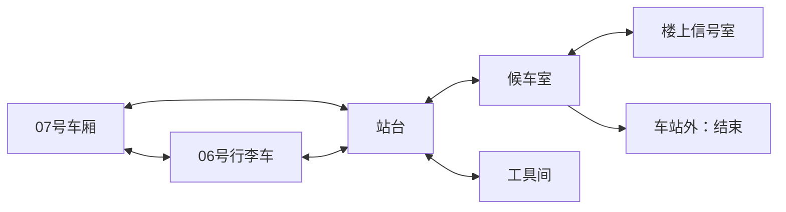

# 旧街最后一封信 · 单人空间探索 RPG（试玩）

## 2026-09-17 照片到屋顶现场（本地机制已接入）

新建完整委托增加可选底片寻回：显影成功后，在显影台翻看照片背面的归档标记，得知对应底片保存在屋顶北侧柜子。归档标记是明确的游戏道具信息，不声称模型生成的街景图证明了柜子位置。屋顶南侧仍连接照相馆与工坊；北侧破损处不能直接跨越。旁边两块木板长度不同，短板不够跨越，长板搭成实际可行走的通路。可提前修通，但未看过归档标记不能凭空挑出对应底片。

走到柜前打开、拿取底片，再决定带回家或交回照相馆。桥板、柜门、柜中物品与照相馆收存状态必须可见且持久；交回后更新人物关系与结局。无计时、死亡、体力或失败次数惩罚。不靠强制此支线把已有旅程延长；旧存档不添加破损地面或重置道具。此为已支持的空间机制，尚不等于实时生成的完整新章节。

## 2026-09-17 完整探索中的材料阅读

玩家已走近记录册／资料架并选择查看后，自动准备并打开第一份内容，不再要求连续点击“展开材料→阅读材料”。准备过程可关闭继续探索；关闭后只允许后台准备，不自动把未看的材料登记为已读。重新靠近打开时继续同一份材料。连接失败或生成失败提供明确重试，不能自动反复生成。匹配记录、取走／留下原件仍需玩家明确决定；自动阅读不自动解题或作选择。

验证一次实际取信→查看记录→匹配→地下资料架的路线；确认关闭、重新打开与恢复不重复产生正文，远处准备完成不算已读。此项只减少操作摩擦，不计作内容量或新章节。

## 2026-09-17 调查旧照的连续性检查

寻找旧照时，图片主题必须对应玩家已经查清的事件；图片只能支持可见细节，不能凭一张图证明年代、动机或先后关系。复核输出的格式错误可以有一次内部修正，不让玩家因为编号或引文格式错误重新开始调查。明确的内容不相符仍拒绝；旧照准备、等待和失败恢复沿用同一旅程，不改写已有发现。

验收以两份真实调查的后续照片方案为主：检查是否保留主题、未捏造历史、可进入同一暗房操作；格式修正不等于语义质量保证，保留失败证据。已有已准入方案与照片不重审、不重生成。

## 2026-09-17 生成前的探索安排（开发中）

新建完整主线在旅程创建时固定一份调查路线：档案间就地查阅、照相馆借阅追查、洗衣店借阅追查。程序只选择已实现的空间能力，模型继续创作同一委托下的真实事件、线索与布局；不能把地点枚举或随机预设称为任意生成关卡。借放路线的密集夹页只在施工索引，外放日志直接可读；就地路线仍可借助放大镜或桌面。

路线以旅程身份稳定选取并持久化，生成重试和重新进入不改选。现有未带路线字段的旅程及准备任务保持旧语义，不重新生成。路线不授予证据、不自动开门、不改变结局门槛。模型不符合既定路线时仅修正未准入草稿，不能偷偷改图或强行转成另一条路线。

本轮核心实验：两条由正常安排得到的不同路线，各生成一个完整调查实例，确认事件与空间安排均可执行；至少把一份真实内容送入实际地图。检查任务重试／旧档恢复及原主线闭环，不重复穷举所有移动路线。完整故事内容量、时长和新玩家理解仍需整合验证。

## 2026-09-17 借阅记录的实地追查（开发中）

新生成调查允许工作日志留在档案架，或借放到照相馆放大台／洗衣店柜台。借放位置在创建时固定，读档不重抽。档案架保留可读借阅条，读后记入发现和当前目标；玩家也可先在桌面偶然发现日志，不强制先读条。只有实际到达正确场景的家具旁查阅，才得到第二份证据。拿到信息后回档案整理桌完成同一个调查，不增加新的结束门槛。

此变化测试“发现能否引导真实地图路线”，不是完整新章节或时长达标。保持单人持续探索、现有工具和结局规则。日志不能同时出现在两个位置，不改写既有旅程；非关键支线、原桌面物品和已有行动不消失。误走地点不会扣资源。验收生成位置稳定、两种外放地点可达、读条不等于读证据、自由输入与按钮一致、恢复、纸层显示及原主线仍可完成。

## 新旅程的显影台操作（2026-09-17）

新建完整委托使用调焦与曝光显出照片细节，替代同一张照片的左右半片选择。玩家走近暗房显影台，观察实际照片的边缘和明暗，分别调整两个7档控制；焦距不合时边缘模糊、曝光不足时暗部难辨、过量时亮部洗白。每次操作立即在原图上显示结果，不等待模型。没有耗材惩罚、倒计时或失败次数限制；只有两项都合适并明确确认，照片发现才进入旅程。旧旅程与已发起的旧显影请求仍使用原拼合机制。

参数随本次照片固定，同一张照片关闭再开和刷新保持本机试调位置；换照片不继承旧校准。已完成结果沿用权威存档及带走/留下的取舍。提示表达视觉差异，不能只说“错误”；键盘和触控都可调节，生成等待与下载失败继续使用现有恢复。

三问：目标是看清与档案有关的旧照；反复操作是观察并调焦/曝光；照片细节清晰且确认才算发现，试调失败不损失进度。只将其作为不同于记录排序的一项现场操作，不据此宣称增加了完整章节、路线分支或目标时长。先验证明暗/清晰度与判定一致、近台确认、旧档不变，以及390/320实际操作；新玩家理解仍未验证。

## 新旅程的完整委托候选（2026-09-17）

本轮将已有档案与暗房组成同一委托，不新增独立游戏。玩家从开场就知道要取回密封信、查清随信寄存的旧事，并找到与它相关的旧照片；照片提供可见细节，不能独自证明年代或因果。照片的主要物件与材料必须与已查档案一致，不能把地砖维修换成木板；未通过核对的候选不能进入媒体制作，既有旅程已保存内容不重生成。主线依次为取信与比对记录、实地调查档案、从照相馆自然门口进入暗房寻找影像、决定带回照片或留下原件后回家。完成照片准备不等于观察，观察不等于决定去向。

新候选旅程才采用此完成条件；既有旅程和结局保持原语义。暗房使用已经查明且保存的历史，不能先生成无关主题占住唯一暗房。每次新旅程的寄存线索可对应三条候选记录中的任意一条，不能总把第一条主题当成唯一主线；已有旅程的题材和记录位置固定。准备期间可继续探索或退出应用，重返后恢复同一内容；失败可重试，不凭失败授予完成。抄便笺、分享发现、帮居民仍可选，均不增加主线门槛。

当前目标应清楚区分“查记录、找影像、拼合、决定去向、带信回家”，不回退为已完成的取材料任务。沿用现有地图、声音与双输入操作。验收新链的阶段衔接与恢复，并保留旧链对照；此候选只验证完整委托结构，不据此声称达成45–60分钟或玩家理解。新玩家三问复述尚待验证。

## 原件与副本的空间取舍（2026-09-17）

观察：补充便笺目前只提供带走/留下，差别主要是行囊和结局文案。新增可选第三条做法：带到照相馆放大台抄录副本，再亲自回原处归还；便笺本来在放大台时可原地抄录。代价是多一次实际操作与归还路程，收益是家人有可携带副本、街区保留原件，不制造额外资源惩罚或关系加分。

抄录只复制已观察且实际在手/台上的内容，不调用模型，不凭空补写历史。原件和副本分开保存，副本不替代原件归还。玩家可以带走原件、留下并转述、抄录后归还；未离开前也可改变原件去向。曾留下原件仍可再借，旧已结束旅程不改写。所有操作提供明示按钮并接同一自由输入动作；不要求猜词，不新增结束门槛。

三问合同：当前目标是决定给家人带什么、给后来者留什么；行动是实际取阅/抄录/归还；进展由原件位置和一份副本体现，没有倒计时或失败扣物品。先验证台上/抽屉两地点的复制、归还、重复回执和刷新，以及手机上两类去向与后续地点能读懂。可执行不等于已经证明玩家觉得额外往返有趣；完整章节量仍未达标。

## 调查工具与替代路径（2026-09-17）

沿用单人持续探索、自然门口和现有纸页/家具美术。新生成档案可有一处密集小字夹页（施工索引或工作日志），玩家需选择辨读方式：已有放大镜可就地读清；没有放大镜也可取下夹页，走到整理桌摊开核对。不是灯光开关或新机器，不承诺新增画面未表现的灯具。两种办法获得相同证据；借用不会自动读懂，必须实际走到桌前操作。另一处普通记录仍直接阅读。

夹页离架后原处纸层消失；带到桌上后显示摊开的纸页，行囊中的借阅夹页移除。可以再拿起、归还，已读证据不丢失。放大镜不消耗；不设计时、失败惩罚、新数值或强制归还门槛。旧实例未配置密集记录时沿用直接查阅，新能力不改写既有题目或结束条件。

核心循环：看见字迹密集→选择手边工具或搬到桌上→获得一处证据→查另一份来源并完成调查。预期玩家能理解当前目标、两种操作和已读反馈；新玩家理解仍未验证。实验只验证两种方法可达、实际纸页位置/知识一致、恢复后可继续；是否减少跑腿感和增加趣味需后续整段试玩，不以本操作增加时长为成功指标。

## 先确定事件，再分发线索（2026-09-17）

新调查在纸条对玩家可见之前，先确定同一段四事件的完整经过及其房间安排；纸条只留下待查问题，两处档案揭示其中的联系。以后进入房间时读取这份已保存内容，不再临时编一套中间历史。生成准备不等于玩家已发现：未走近查阅的证据不进入发现页或人物对白；结局仍须由真实调查和玩家操作达成。

本次沿用现有材料比对、地图移动、移架和整理，不新增强制回合数。重点验证一份生成内容能否同时支撑开场悬念和最终解释，并在退出/恢复后保持一致；不能只凭模型自评通过就认定故事连贯。历史已读纸条保留原文，仍走兼容的后续生成，不要求玩家重新开始。

## 动态调查的连续性与失败恢复（2026-09-17）

沿用当前单人探索、自然门口、材料比对及档案调查。下一段内容必须承接玩家已经读到的材料：事件身份不变、历史先后符合常识，不能把待调查的答案提前写在未署日期的纸条上，也不能靠多造一个问题延长游玩。

生成时先检查可执行性，再复核新材料与前文的因果关系；有明确问题时最多修正一次。复核不要求文学完美，不因轻微措辞或氛围瑕疵重生成。再次失败则保留现有旅程，允许继续探索或主动重试，不开放一个无法完成的房间。生成、复核和修正共享原等待期限；不能逐次延长期限让用户一直等。已准入和已阅读的内容不在后台重新编写。

本轮实验：通过真实模型同时生成两组完整材料—档案—房间，检查事实承接、可解性、布局准入与实际查阅结果。成功信号是完整内容可用且有真实变化；结构通过、复核通过均不能单独证明故事有趣或已达到目标长度。重点处理此前真实发生的种树/采购顺序错误与无效布局，不继续扩大路线回归清单。

真实试验后调整分工：故事作者给出资料架偏左/偏右、0–3座储物架、可移动阻挡方向或无阻挡；空间生成器据此组合具体摆放并检验通路。房间不选自固定整图列表，生成后仍随旅程保存，不在回来时重排。已有生成格子图保持可读取。这避免把故事生成绑在模型逐字符绘制地图的能力上，也不声称可以生成任意大小或任意新机制的空间。

## 动态房间的可移动储物架（2026-09-17，本轮实验）

沿用持续单人探索与随时续玩的结构。在新生成档案间里可出现一个可左右挪动的储物架，挡住施工索引的正面查阅位置；旁边预留一个等大的停放位置。玩家走到架前，明确选择移向哪边，架子及其碰撞位置一起移动，露出可走到的索引。可以移回原位，已读证据不因此遗忘。旧房间没有此布置时仍直接调查，不强制所有房间多一步。

核心循环：看见遮挡 → 走近储物架 → 移开 → 看见空出的查阅位置 → 走过去读证据。测试空间观察和行动后果，不测试手速或猜口令；无倒计时、分数、道具消耗或新结局条件。自由输入中的移动提议与按钮执行同一行动，纯叙述不能改变家具位置。

房间开放前必须证明：入口和移架操作位置可达；两种摆法均能安全操作并返回；移开后索引、日志、整理桌均可达；移回不能压住玩家。只允许一个储物架、一个相邻的水平停放位置，暂不做任意推箱或连锁挤压。动作失败保留当前状态，可以退开再试。摆法、调查进度随旅程保存。

实验问题：已准入房间能否通过一次真实物件移动，开放此前受阻的调查位置？通过信号为地图上架子移动、旧占地可通过、新占地不可穿、索引可正常调查，并能往返/恢复；若只有文字说移开而图形/碰撞未变，或只能从测试入口绕过障碍，则停止扩展并修复。玩家理解与趣味性仍为待验证假设，不把一次移架当作完整章节或延长游戏的充分内容。

## 动态档案间的真实空间（2026-09-17）

新生成档案间允许重新布置两处资料架、整理桌和最多六座固定储物架；物件位置实际影响行走与绕行，不再只在左右交换的两套摆法之间切换。南侧入口和回程固定，所有资料和桌面均能从入口走到。生成内容不允许加入没有素材的门、人物或物品；本次复用已有桌架与木地板。无新收费行动、隐藏结局门槛或碰撞规则。

布局在进入前准备并随旅程保存，第一次进入、离开返回及刷新时一致；失败不开放不可达房间，玩家可以留在街区继续活动后重试。旧旅程保留原摆法。先验证两份真实生成布局的不同走法，再推进不同任务内容；本项只证明空间变化，不代替完整故事或目标时长验收。

## 调查后的可选公开记录（2026-09-17）

档案调查完成后，玩家可以回修表铺，把已经核对的公共事件经过抄入记录册，供后来者阅读；也可保留为私人发现。抄入的是摘要，原件仍按此前带走/留下的选择保存，密封家书不公开。只有在记录册旁才能写入或撤下，离开街区前允许改选；不加分、不改变居民好感、不新增结局门槛。撤下不抹去玩家已经学到的发现。

写入后，册页上出现独立纸页；回来、刷新、查看发现页和后续交谈均识别摘要当前是否公开，不能声称居民已经读过。结局只陈述最终仍留下的摘要。未完成调查或旧旅程没有档案发现时不出现该选项。验证一次写入→离开/返回→恢复→撤下/重新写入和结局反映，覆盖直接按钮与自由输入的同一权威操作；不以这项可选后果证明时长已足够。

## 真实生成后的调整（2026-09-17）

下一步采用两事件调查合同：新材料明确列出两个已发生但先后未知的事件，问题由这两个事件生成；后续档案必须保留它们，用两项中间记录连接。两处来源合起来才能确定两事件顺序，结论从该顺序生成，不能另写缺少证据的结论。模型仍负责具体事件与片段，程序保证题目、证据和答案的指向一致；片段是否提前泄题、事件是否有趣仍须真实内容评审。旧材料无此合同则按原实例读取。

动态材料比对的可解性由游戏构造：模型提供两种标记、两种包扎和三个记录主题，游戏组合唯一双特征匹配项与两个各匹配一个特征的干扰项，再保存本次顺序。不能要求模型自由写出三条记录后假设其中必有答案。旧材料内容与顺序保持不变。

真实首批内容已暴露“排序合法但没有回答所提问题”的缺口。后续调查必须新增有用证据并回应前段疑问；如果前段已经叙述了大部分顺序，或档案没有涵盖问题中的关键事件，不能仅凭可排序就认定内容合格。详见 `campaign-live-20260917/review.md`。

## 主线因果衔接合同（2026-09-17，本轮实现）

观察：v2 已把材料与档案解谜列为结束条件，但开场只许诺取信，纸袋也可能已经讲完事情，导致后续调查像额外门槛。本轮保持地图、人物、资源和谜题不变，补齐一次明确委托及待解问题。

- 仅新建 v2 从开场说明：家人请玩家取回密封信，并查清随信寄存的街区记录；原件可以带回，也可留在当地转述。不拆信、不编造新具名家人。
- 信旁寄存条 → 铺内索引确认纸袋 → 地下室读到事件片段和一个具体的先后疑问 → 隔壁档案两处证据 → 还原经过 → 携原件或口述回家。旁人的旧钟、照片与暗房继续可选，不额外增加强制跑腿。
- 新生成纸袋应包含 `question`，只涉及同一匿名公共事件的经过，不能在片段里预先给完整答案。后续档案必须围绕该问题，结论须来自四事件与来源关系。旧实例缺少问题仍可原样读取，不重生成、不补造旧历史。
- 委托进入持久开场、发现页和可见模型上下文；未查阅的纸袋问题和未解出的结论不能提前泄露。成功结局回应委托和原件去向。
- 这能修正目标与行为脱节，但不证明内容有趣、45–60分钟成立或真实生成质量。验收限定新开场、待解问题到结果的传递、旧档保留与核心结束条件；不重复整条地图路线。

## 第二阶段中段：档案工作间（开发合同）

当前「寄存记录→材料正文→取舍」仅验证内容衔接，不能独自满足完整探索主线。下一增量从地下储物室的自然侧门进入一间档案工作间，复用已准入的地面、桌子和资料架；不以点击抽象线索直接转场。只为明确创建的新版本旅程加入，旧旅程不追加任务。

房间内两处资料架保存不同的工作记录，中央桌面有4张待排序的事件卡。玩家走到各处调查，再根据记录里的先后关系，在桌面还原顺序。生成器根据上一段实际取得的材料生成4个相关的日常事件、分布在两处的关系证据和简短发现，并从两种可通行布局中选择一套；具体事件、正确顺序及线索分布可以每局不同。不能只给同一个固定谜题改名字，也不让模型决定判题结果。

每处至少提供一条先后关系，两处合起来必须存在且仅存在一个完整顺序；任何一处单独不足以唯一解出答案。卡片顺序与真实答案分开。界面需允许回看已调查的证据、自由调整、明确提交；错误不扣资源、不删线索，成功只记录一次。背景准备不能占用玩家行动，房间碰撞、入口、调查点与回程均可用后才开放。玩家可以随时离开，回来继续，已生成内容不重新抽取。

本段的目标/动作/进展合同：弄清寄存材料中那次公共维修的过程；在房间内查证两组记录、在桌面尝试排列；有依据地还原才是进展，猜错可继续调查。不是要求帮助全部居民或重复跑旧支线。核心假设为分散证据能使地图调查有用，待实际renderer试玩验证；不能用程序求解通过代替玩家理解证据。45–60分钟仍是全游戏待实测目标，本段不声明已达到。

> 当前阶段（2026-09-17）：第一阶段UI已达到本地可用基线，继续第二阶段的完整主线与动态中间内容。以下首轮UI“尚未验收”等记录属于当时状态，最新证据见 `ui-polish-review-20260917.md` 与 `campaign-map-playtest-20260917.md`；真机、声音与线上整合尚未完成。材料准备就绪后一次点击即可阅读，再由玩家作出选择。取走旧照片不会隐藏另外留存的主线原件，两者视觉状态必须各自对应真实去向。新主线仅应用于明确创建的新旅程。

## 最终技能固化前的交互与 UI 打磨（2026-09-17 用户确认）

首轮实现合同：探索时右下角保留一个与当前选中对象一致的主行动；只显示必要的临时反馈，不常驻空背包和重复行动按钮。点击人物或主动交谈才展开话题；介绍与对白按原文短段展示，继续按钮只翻展示页，不提交剧情行动。最后一段后显示话题与实际可执行动作，自由输入通过明确按钮展开。收起或重新走动恢复探索，镜头尺寸不随面板变化。错误恢复和已有暗房入口保持可达。此轮先改行动 / 对话，不同时改碰撞与相机算法。

**结局演出（用户追加）**：最终结局不能继续使用当前简单弹窗卡片，须列入本轮 UI 与交互打磨。以实际场景和已准入人物 / 道具为收尾画面，配合克制的镜头、过渡、声音收束与短字幕，呈现该旅程真实的选择后果；再显示回看与重新探索入口。演出可跳过、可重看，减弱动态设置下仍可理解。结局事实在服务器确认后才播放，刷新、跳过或回看不得再次交信、改变背包或重结算；未完成的帮助不得被画成已完成。先复用现有素材形成有效演出，不以大量额外生图为前提。本地已用全屏尾声替换旧卡片；尚未并入下一次集中线上更新。

用户进一步选定演出形式：**人像或关键物品 + 类似电影片尾字幕的呈现**。图像作为安静的视觉主体，字幕以短段淡入或缓慢移动呈现旅程结果、人物后续与未完成牵挂；不是重新画一张大卡片，也不是用工作人员名单替代剧情结尾。优先复用本人旅程已准入的人物或道具图，避免新旧人物串档。默认自动节拍必须允许暂停 / 跳过与回看；减弱动态时改为静态逐段切换。

用户明确要求：在最后制作可复用技能之前，认真打磨真实游戏的交互和 UI。此前“先验证结构、UI 精修后置”是阶段顺序，不代表可以跳过体验打磨直接固化技能。本条优先于下方历史的精修后置说明。

保持已认可的电影式信息结构（A 的信息结构、B 的临时提示、C 材质少量用于设备特写）、全屏放大地图、B 视角、镜头跟随、摇杆与点击双输入。先完成正在收尾的内容与恢复工作，再开展一轮集中的本地体验打磨，不为此频繁发布。

- **移动与就近行动**：检查摇杆跟手反馈、点击目的地、对象选择、右下角行动按钮；接近多个对象时目标与按钮对应明确，提示出现/消失不推挤地图或使镜头抖动。
- **人物交谈与自由输入**：短对白、明确说话人、可选话题或行动，自由输入作为补充；减少长文与重复说明，退出交谈能顺畅继续探索。正式入口没有调试说明、测试开关或协议术语。
- **探索与物件操作**：门、道路、楼梯及阻挡状态自然可辨；拿取、借还、清障、解谜的结果在原场景及时反馈，普通操作不过度弹窗，特写关闭后回到原位置和注意对象。
- **等待与恢复**：首入、转场、动态生成与下载失败分别给出合适反馈；能继续探索时不锁住全屏，必须等待时明确当前进展及可做的事，不制造虚假进度。
- **统一视觉与手机适配**：收敛字号、按钮层级、间距、图标、面板与过渡，保留地图为主要视觉；覆盖 320×568、390×844 和桌面，重点检查英文长度、键盘弹出、安全区与单手操作。

验证以一条有代表性的“进入→探索→交谈→操作/解谜→离开→续玩”体验链为主，按发现的问题修复并复验对应状态，不把每条路线重复通关当成 UI 验收。自动化证明可执行和布局稳定，不替代玩家理解与手机实际手感的判断。完成顺序为：本地实际体验审查与修复 → 集中生产验证 → 根据已验证实现固化技能；不能只写设计文档或包装当前组件就称技能完成。现阶段仅记录本轮要求，尚未完成这轮 UI 验收。

> **当前实现与交付范围（2026-09-17）**：本项目已以旧街作为默认主试玩入口，不再处于等待选题阶段。旧列车仅保留参考和已有旅程。当前仍是 preview，不能将已有完整规则和阶段结局称为正式单人游戏验收完成。主线/地图/输入等近期进展以代码与本文当前交付状态为依据，下方列车候选和旧时间记录属于历史。
>
> 新旅程的 Mara/Nora 行走已按用户认可的瑕疵范围接入；各场景表现持续补齐。当前集中试玩已完成照片/取信至结局及恢复，仍需声音、自由模型/动态扩展和最终平台手机验收；正式联网与双部署集中进行。当前匿名旅程持久化不等于平台账号跨设备续玩。不要用继续增加相同规则测试来替代这些交付项。

> **最新方向（2026-09-15）**：用户建议当前游戏内部收尾，重新规划适合单人探索的故事，也允许彻底改写。暂停以下列车长篇、供电谜题和站房候选的扩展；保留代码与存档。[内部复盘](exploration-retrospective-20260915.md) 记录经验与未完成项，[三个题材候选](next-exploration-story-options.md) 用于下一步选题。后文仍是当前实现及历史候选，不能据此自动继续旧方向。

> **最新优先级确认**：电影式 RPG 界面仅作为暂定基准，非最终界面。先跑通地图探索与完整结构，不继续精修面板。主验收是自然出入口、不同探索顺序、可往返路线、物件改变空间、状态续玩；UI 风格确认不等于新题材已经定稿。

## 受众与地域背景待定（2026-09-17）

**人物比例边界（用户补充）**：当前几位人物圆润、偏胖，可以用于本次游戏，但不是人物美术或人体比例的标准基准。素材准入只证明这次使用可接受，不把其体型写入默认生成提示、技能模板或全角色比例要求。后续按角色设定体现身高、体型与剪影差异；继续复用的是B视角、脚点、图集格式和场景尺度，不是统一圆胖造型。

本轮居民接入：新旅程的洗衣店主采用用户认可可接受的铜棕短发、青绿色工作衬衫形象，称呼为玛拉 / Mara，继续原店主的任务与关系。她在店内沿固定短路线缓慢来回，接近或交谈时停下并面对玩家，离开后继续；不增加剧情回合或改变物品。旧旅程保留阿岚的外观、名字和已发生经历。轻微素材瑕疵可以接受，以正常场景尺度的可玩性为先，不要求人物动画达到完美。

用户已观看左右走动对照并明确接受轻微不自然，允许在主游戏使用左右行走；不继续为此反复生成。摄影师在工作区横向活动，店主保留当前纵向活动路线，这属于场景编排而非禁止侧向动作。

摄影师沿同一流程接入短卷发、深蓝工作服与眼镜的诺拉 / Nora，保留摄影师的照片任务、同意展示与关系后果；新旅程采用新介绍，已有许青旅程保留。她在照相馆工作区短距离活动，接近时停步交谈。旅程菜单允许另开一次探索，当前进度保留在旅程列表，玩家不必先通关才能重新开始。

用户明确：AlterU 平台主要面向美国用户，为美国用户准备。 用户进一步明确人物阵容不以东亚人为默认或主体，东亚角色可偶尔出现、占少数；整体角色姓名、生活经历和环境语境面向美国用户，不把所有角色统一成一种族。英文人物命名、对白和故事理解成本作为主要受众设计基准，不得因为工作交流使用中文而默认中国背景。用户允许评估更换洗衣店主形象以改善人物生产；当前中文名字与东亚生成提示词是制作时补充，并非已确认产品要求。架空旧港口小镇、多背景居民为候选世界设定，尚未正式定稿。角色外观调整应优先简化服装层次、增加两腿与双臂的可辨识轮廓；不把更换族裔当作能修复步态的技术措施。保留角色稳定 ID、关系、任务和已有旅程记录。没有受众测试证据时，不宣称美国用户天然排斥东亚故事。

## 执行优先级与测试边界（2026-09-16，用户纠偏）

新增当前最高优先级：验证玩家提出新路线→模型提出结构化支线→补齐缺少素材→真实地图开放→可互动/可续玩的动态扩展闭环。首个能力合同为照相馆暗房：一处既有空间连接的新房间、一件可互动发现，复用已有解谜模板；不是任意无限地图。先把玩家意向存入现有旅程，准备期间仍可探索；计划和必要素材未就绪时不宣称房间存在或开放。制作页生图、非关键插画、固定支线分别不等同本闭环。旧路线复走暂停。

暗房自由输入与按钮共用相同后果：表达拼合意图打开实际谜题，不凭一句话判定完成；拼合后“带走照片／留在这里”按同一服务器规则保存。只观察不触发领取。

扩展入口接入正常本地探索：后台明确报告支持时，照相馆显示暗房探索入口，暗房显示照片操作；不需要expansion参数。仅debug入口保留重生成，默认试玩不展示。后台未提供能力时原地图继续可玩。首个模板明确为暗房，不用“任意新去处”的措辞误导。

当前扩展后果：拼合后可以带走照片（随身增加一张旧街照片）或留在暗房（不增加物品），可先离开再回来决定。选择一经保存不重复领取；发现页与阶段回顾如实记录选择。模型旧文案未匹配当前场景设备，不直接展示，不附会未证实历史。

最新确认：动态内容首先保证正确执行，画风与细节后置，仅在影响辨认、操作或剧情一致性时优先修复。当前照片采用已有拼合模板，服务器验证当前图片hash、片段与方向，结果保存为旅程发现；精细媒体调整暂停。

用户补充：测试优先取得真实生成与可玩结果，不以生成次数作为硬上限；按具体失败调整后复测。幂等恢复仍避免意外重复生成。

当前实现下一步：为已保存的暗房计划绑定一张768×576解谜照片，任务与原始PNG持久保存。刷新/网络失败沿用同一请求，只有明确终止失败才更换生成请求；基础房间持续可玩。照片先作为候选，图片就绪不直接改剧情事实。

用户进一步明确平衡点：结构和基础表现齐备即可进入，复用材质与工作台，不等精细环境图；背景在安全时机替换且不改变坐标/碰撞。只有依赖图像辨认的谜题等待对应图。首轮最多环境/谜题两类补图，不建设复杂过渡系统。基础空间的进入/等待文字由已有表现固定提供，模型扩展发现和新图片内容；重新连接仅用于故障恢复。

优先证明核心机制，再完成游戏内容；不反复手动走完所有路线。近期清路、拾取、往返及刷新已有多份证据，停止因纯材质改动重跑照片/旧钟/取信全链。本条优先于后文“最近修改的renderer复验”等宽泛待办：复验必须限定到实际受影响机制。

后续按以下三个阶段推进：

1. **完成本地游戏内容与空间表现（当前）**：补两位居民可用动作、场景与入口的重要表现，检查每个空间的探索作用、线索与选择价值，消除仅作为空房间/跑腿路程的内容。沿用已通过的移动、碰撞、行动、状态与续玩机制；不为了45–60分钟指标填充机械往返。UI基准保持。
2. **一次集中的本地整体验收**：内容稳定后走一条完整主线，覆盖有代表性的可选帮助及结局差异，评估可理解性、探索节奏与移动端构图。分支规则主要依靠现有自动化，不要求每个分支全程手动重玩。发现具体问题才回到对应环节修复、复验。
3. **生产联网与发布验收**：集中验证平台身份、跨设备恢复、真实叙事/媒体请求及等待恢复，完成同commit主站/Pages与AlterU完整体验。仅在网络功能确实阻塞开发时提前发布；多人后置。

测试触发合同：移动/碰撞/转场算法改变→相应代表路线；物件/规则改变→对应动作及持久化；叙事许可改变→对应合成模型用例；纯美术改变→该状态实际画面，不重跑故事；安全/身份检查→接口或发布边界变化时执行。已有通过证据可沿用，除非实现变化或新失败使其失效。每次测试说明“测哪个核心机制、为什么现有证据不足、通过后转入什么开发工作”。不把安全检查、路线数量或反复截图当作开发进度主体。

## 当前交付状态（2026-09-15，优先于下方早期进度记录）

旧街是现有游戏默认试玩入口（old-street-runtime-contract），旧列车保留在参考入口，存档不混用。8个房间、10对连接、摇杆与点击、上下文行动、局部拼图、人物介绍/关系、自由输入与受限交谈、Session事务和阶段结局已接入代码。多条本地规则/持久恢复路线已有证据，不等于完整体验全部验收。

尚需完成的主要交付项：各房间及可变物件的完整统一美术、两位居民可用行走素材、完整试玩的节奏与内容量验证、最近修改的真实renderer复验、可信平台账号及跨设备恢复、同一大版本双部署和AlterU完整体验验证。45–60分钟是设计目标，尚无证据证明当前内容达到这一时长；不得用增加机械往返或测试数量替代内容。UI保持暂定基准，不以持续面板精修代替地图完成度。

照片夹拿取/跨房间返回/刷新、初次地图恢复和两组三级提示已补完365×677本机实景检查，照片归还也已有桌面可见后果及刷新证据。精确手机尺寸、完整美术和生产平台验收仍未完成；不把这些局部检查当作正式游戏交付。

## 新故事开发假设：旧街最后一封信（2026-09-15）

旧街故事现已作为现有主游戏的默认试玩方向推进，正式生产验收尚未完成。这里保留推荐候选 A 的玩法蓝图，题材和表现仍按试玩反馈迭代。旧列车与站区设计在下方保留为历史，不能混入本故事。沿用已认可 B 视角、手机镜头、摇杆与点击移动；首次完整故事以单人、空间调查与物件操作为主。新剧情不得改写旧旅程。

### 1. Overview

玩家受家人委托，到准备改建的旧街取一封寄存在修表铺的信。门开着，修表师不在。他正在河边工作棚整理旧物，准备离开；这是预先写定的事实，不是模型现场决定的失踪案。找人取信是明确主线，帮助旧物回到主人手里是可选深入内容。

一次游玩为连续探索，初轮完整内容量暂按 45–60 分钟设计，允许每次 10–20 分钟分次完成；不是计时挑战，也不靠增加往返次数凑时长。持久化已发现线索、物品及其位置、门与捷径、人物介绍/关系、当前房间与安全脚点、离开时的实际结果。可在任一已提交动作后停止；回来继续未解开的物件关系。没有每日回访或重复刷资源。

首次有效行动：在修表铺移开压着抽屉的空工具盒，抽屉可拉开，露出修件收据与一把放大镜。取放大镜后原位置变空。抽屉中的短留言说明“信在上锁的小格里，钥匙我带着”；玩家明确接下来找人，而不是被派去启动列车。

前 10 分钟应能自主选择照相馆或院落/洗衣店，至少有一件实物发生可见变化，并发现另一条回路。找到修表师是一个自然停止点；取到信即可主动离开，剩余帮助不会变成强制任务。

### 2. Visual Design

8 个空间：街口、修表铺、合住院、洗衣店、照相馆、地下储物室、屋顶、河边工作棚。街口包含可步行的短街段，不以菜单选择店铺。每处使用与身份相符的尺度，背景只画不变环境；门、箱子、抽屉、旧钟、照片夹和钥匙是独立状态物件。沿用 B 俯视方向，禁止用列车图改名冒充店铺。

空间连接（双向，除结尾主动离开外均可返回）：

| 两端 | 玩家看见的连接 | 初始状态与开放方式 |
|---|---|---|
| 街口—修表铺 | 街边店门 / 店内门口 | 开放 |
| 街口—照相馆 | 橱窗旁店门 / 店内门口 | 开放 |
| 街口—合住院 | 巷口 / 院门 | 开放 |
| 修表铺—合住院 | 后门 / 院中后门 | 开放，形成第一条回路 |
| 合住院—洗衣店 | 掀开的门帘 / 后院门 | 开放 |
| 合住院—地下储物室 | 向下台阶 / 楼梯口 | 入口被旧箱挡住；借用洗衣店闲置推车，把箱子移到标出的空地 |
| 照相馆—屋顶 | 内楼梯 / 楼梯间出口 | 开放，不需要先读收据才能上楼 |
| 屋顶—河边工作棚 | 完整外楼梯 / 棚侧阶梯 | 开放；这是第一条找人路线 |
| 地下储物室—河边工作棚 | 地下出口台阶 / 棚前台阶 | 开放；这是另一条找人路线 |
| 河边工作棚—合住院 | 从棚侧可抬起的院门插销 | 初始插销落下；从棚侧打开后永久成为双向捷径 |

地图坐标待白盒确定，以上是连接设计，尚非已完成背景。不得让调查照片、对话或整理箱子直接执行过门。打开路后，玩家仍亲自走过去。普通门不显示确认弹窗。

界面按用户最新建议复用既有电影式 RPG 的成熟视觉风格，具体颜色、字体、面板与按钮从真实参考实现提取；沿用地图主舞台与自然出入口，不复制逐幕换图结构。对白采用短轮次、明确说话人和 2–3 个当前有意义的选项；自由输入是补充。普通物件只用就近行动按钮和短反馈。仅对辨认钟底刻痕、比对照片等细节开启局部特写。开场不展示未来人物名单；初始只有家人委托中提到的修表师身份，其他人由可见接触介绍。

### 3. Game Mechanics

核心循环：选择可见路线 → 观察/操作实物 → 得到线索或改变通路 → 自己决定去另一处印证或回访 → 世界保留变化。主线没有必须收齐的线索数量；发现捷径、提前找到人都是合法探索。

**基础取信链**：铺内抽屉提示小格钥匙在修表师手里 → 可以沿照相馆楼梯到屋顶再下到工作棚，也可借推车清开地下入口过去 → 看见修表师正在擦拭旧钟，他表明身份并借出小格钥匙 → 玩家可打开棚侧插销走捷径回店 → 钥匙打开小格，取出写有家人姓名的密封信 → 街口主动离开。玩家直接探索找到人时同样能借钥匙，不要求补点收据。上锁小格是一件可识别且被提前说明的物理障碍；不是通关密码题。

**可选旧钟链**：工作棚得到修表师同意后取走待归还的旧钟 → 用铺中放大镜辨认底部成对的燕子刻痕 → 照相馆的照片放大台可看清同样的刻痕及洗衣店旧店面 → 回洗衣店把实物交给店主确认。若先直接带钟询问，店主也可凭实物确认；照片是另一条可发现的证据，不做“知道答案仍不准操作”的门槛。没有证据时自由输入不能把钟归给其他人。归还后钟在店内实际摆出，背包不再持有；短对白与关系记录持久化。

**可选照片链**：地下储物室找到照片夹，位置/箱子与照相馆收据上的图形标记对应 → 带回照相馆在放大台比对两张照片的断裂边缘，恢复原来同一张店面旧照的关系 → 摄影师确认这是自家旧底片，并决定哪一张可留下公开展示。错误配对不损坏照片，随时取回。完成后照片夹归还，展示台改变；没有得到同意的照片仍属私人资料。

**记录的选择**：主线信件始终密封交还家人，不拿它交换帮助或把隐私公开当最优结局。完成旧钟/照片帮助后，可分别询问对应主人是否愿意留下物件照片和一两句说明。同意后才在修表铺的街区记录册中收录该条，未同意可跳过。收录前提供保留/撤回该条的选择，正式离开前可以修改。无需把三个人的所有隐私问完才能结束。

三位固定实体人物：修表师（工作棚）、洗衣店主（洗衣店及相邻院中有限活动）、摄影师（照相馆）。无默认同行。靠近互动者停下并转向，离开后恢复有限活动；四方向动画须单独准入，不能用站姿滑动标记完成。玩家已见到的角色才进入已认识列表。两位可选人物不构成基础取信前置。

物品规则：放大镜、钥匙、推车可反复使用，不消耗；旧钟和照片夹有唯一位置（原场所、背包、已归还场所），禁止重复取物；信件只可取一次。无背包格数、体力、燃料或货币。推车只移动已经标出的箱子到空地，不允许任意搬动堵死路径。错用道具给一句可观察的原因并保留物品；不能重置全旅程。借出物品在离开前可归还，不能因为已把钥匙归还就永远取不到未拿的信，修表师可再次借出。

AI 可以围绕已发现物品、人物态度和记录意愿作短回应，提供“看哪里 → 比较什么 → 具体操作”的自选三级提示。固定事实、物件归属、可走出口、物品数量和结局条件由规则掌握。模型不可用仍可用按钮完成全部主线和支线；未制作人物/空间不能被自由输入放行。不可通过聊天瞬间拿信、穿墙、改变人物服色或翻开密封信。

### 局部观察的自选提示（实现补充，2026-09-15）

钟底与照片特写增加可选三级提示：首次只给观察方向，再次指出比对依据，第三次给出明确操作。每次只显示当前一条短提示；不自动切换观察区域、选择照片、旋转或提交答案。图片未载入时不展示提示入口，提交中禁用；关闭特写后再次打开从未提示状态开始。提示只帮助玩家继续探索，不写剧情事实、奖励、关系或存档，也不依赖模型可用。照片拼合仍需正确片与方向，钟底仍需观察区域和辨认结果由后台确认。

### 早期规则实现记录（2026-09-15，历史状态）

`src/old-street-cartridge.ts` 新增本工程内的中英文旧街草稿：8 个地点、10 对双向连接、主线取信、推车清路、棚侧插销捷径、旧钟与照片支线、记录同意/撤回及离开结果投射。它使用现有 Story Core，未注册正式入口，没有新建公开游戏或后台。用户尚未明确选定题材，当前内容仍是推荐 A 的开发假设。

Core 测试跑通屋顶/地下两条完整取信规则路径、跳过可选帮助、物件归还和撤回记录、错误地点拒绝、重复取物拒绝、提前还钥匙后重借、JSON 回读继续。没有读收据也能通过门、借钥匙；没有常驻资源条。照片配对目前只是领域结果规则，具体配对输入校验还没做；人物只有候选对白，没有可见介绍到 roster/关系的完整提交。`departed` 与结果投射尚未接正式 ending/finale。

这些是规则证据，不能称为地图实机试玩：当前仍缺空间坐标/碰撞、准入美术、实际 renderer、Session 原子提交、自由输入动作适配与人物连续性。下阶段首先装配自然出入口和真实移动，避免继续只增加规则测试而没有可走地图。

### 数值系统评估：不预设三条指标（2026-09-15）

用户要求综合判断，不强制保留三条数值。当前探索故事设计结论是 **0 条常驻资源条**，这不是所有 RPG 的通用限制。准入标准：玩家能明确知道数值怎样变化、会据此改变什么行动、下降/耗尽会发生什么，以及怎样恢复；缺少这些因果关系就不建立指标。

- 燃料/车况适合列车生存故事的路线和维修决策，对旧街步行探索没有用途；旧列车存档和玩法保留原定义，新故事不继承。
- 体力会给已鼓励的往返探索添加额外消耗，当前没有需要体力形成取舍的挑战或恢复循环，不引入。
- 心情/好感不做常驻仪表；用具体行为、对话和持久关系事件表达信任及是否愿意借物/留下记录。不得暗中用任意分数卡住找人取信。
- 不加探索百分比、线索总数或任务总进度条，以免把可选发现变成逐项清单，并提前泄露未发现内容。只在需要时查看已经发现的线索和当前明确目标。
- 道具位置与数量仍保留在背包；独特钥匙/工具不以数量占 HUD，确有可堆叠消耗物时才在物品旁显示数量。门是否开放、箱子是否移开、东西是否归还优先在场景中直接看见。
- 若后续实际玩法加入有限灯油、危险或可消耗工具，先验证能否产生有意义且可恢复的选择，再按需增加 1 项或更多；不能为了旧模板对称而固定为 3 项。

这项判断服务地图探索优先原则，仍需在完整路线试玩时检查目标是否清楚；取消数值条不等于取消即时行动反馈或持久进展。

### 4. Controls

桌面 WASD/方向键移动，点击目的地寻路；手机摇杆和点击移动同时支持。右下就近行动按钮标明“拉开抽屉 / 拿取 / 开门 / 交谈”等具体动作。靠近门后的穿越使用同一个移动/出入口合同，房间内检查动作不传送。对话选项与物件目标均走相同权威 action ID；背包使用进入选择目标，可取消且不丢物。特写支持关闭回到原位置，不能让放大界面成为唯一找得到出口的地方。

### 5. Win / Lose Conditions

无生命、倒计时、战斗、死亡或 Game Over。基础完成条件是持有密封信并在街口主动确认离开；在此之前都可继续探索。结局按离开时的真实事实组合：信已交付、旧钟已归还/尚在原处或背包、照片已归还/未解决、哪些记录经同意留下。不是把完成项数量映射成差/好/真结局。离开确认只列实际未归还的借物及未完成的自选帮助，不夸大失败。确认前可取消；确认后保留只读结局，重新探索需显式另开旅程，不回滚权威档。

保存恢复必须同时恢复故事地点与房间脚点；同一地点内的楼梯不推进场次、时间、危险、关系或生成新正文。中断操作只恢复到一次已提交结果，不复制物品。旧列车存档按旧 cartridge/version 继续，不能直接加载为旧街。具体生产 Session 装配仍待实现与实测。

### 6. Sound Effects

脚步按实际移动距离触发，石街/木地板分材质，静止无脚步；初值相邻触发最小 120ms，之后按步态 QA 调整。抽屉/门栓以操作接触点播放约 150–300ms 的木/金属声；一次成功拾取用约 120ms 的轻提示；错误配对给约 100ms 的轻碰声，不用惩罚警报。对话开始不重复播放成功铃。河边环境声按场景淡入约 600ms；静音与系统减少动态偏好保留。基础脚步与拿取/物件音现以短合成音接入，无新录音；脚步每28世界单位且至少120ms触发，声音开关放在旅程面板并记住选择。河边环境声和背景音乐仍待制作，听感与iPhone恢复尚待验收。

### 最先验证的风险与通过条件

| 风险 / 当前证据 | 实验 | 通过信号 | 失败后的调整 |
|---|---|---|---|
| 玩家反馈旧剧情像按幕转场 | 分别按两条找人路线往返，同地点过门 20 次 | 房间位置变化；场次、时间、物品、正文不变；总能返回原门 | 修唯一转场合同，不能给每门加剧情 |
| 旧街可能仍是读文跑腿（假设） | 关闭自由输入，只看环境与短选项完成取信及一条支线 | 关键操作可见，至少抽屉、清路、插销、小格、实物归还产生状态变化 | 减少无操作意义的收据/对白，重做物件关系 |
| 线索可能变成隐藏许可（设计风险） | 从未读收据的初始档先到工作棚，直接带钟找店主 | 可以见人借钥匙，也可凭实物归还；不要求补勾线索 | 移除知识旗标对物理动作的误锁 |
| 支线不应强制拖延主线 | 跳过洗衣店/照片夹直接取信离开，再跑全帮助路线 | 两者都能结束，结局只反映真实差异 | 去掉强制角色/全收集前置 |
| 自动化不能判断理解 | 新试玩者在首个抽屉闭环后复述目标、常做动作和进展 | 知道找人取信、探索印证/使用物件、开路拿信；知道无倒计时 | 当前 comprehension unverified，后续不能用脚本替代 |

### 当前工程发现与下一步

`StoryCartridge.statDefinitions` 原先强制恰好三个数值；本轮已将本地 original-train Core 类型改为列表，允许探索故事不配置生存指标。中英空指标动作及原作三指标初值测试通过；新故事界面的空 HUD 仍需真实装配验证，不以填三个无意义数值绕过。`createInitialSave` 原先默认加电影式开场图块；本轮新增 `opening.imageMode: none` 供空间故事显式关闭该自动图块，旧作未配置时仍按原逻辑排队。这里只解决开场，不代表所有后续模型/媒体入口已经适配。

本轮先整理可复用的普通出入口准备函数：复用现有 Core 的准入与 map 效果，允许多个房间共享一个故事地点；不加另一个保存系统、不调用模型。它仍需接入正式 Session 的原子版本提交和 renderer，不能以纯函数测试宣称整套过门已经上线。然后才按这个故事制作白盒、完整权威规则与双路线试玩；此设计尚未触发批量美术或发布。

## 当前优先事项：空间探索适配重审（2026-09-15）

用户实际试玩反馈：完整列车故事限制主角自由行动，与列车和众多乘客绑定，体验“憋屈”；早期独自探索车厢、物品解谜更有吸引力。这是玩家反馈，不可用自动通关、跟随动画或更多乘客素材抵消。下文列车需求仍记录当前实现；它不再作为继续扩展剧情的默认设计依据。

### 决策与边界

暂停扩大列车路线、群体管理和批量同伴动画。保留当前代码、已有旅程、B 视角、双输入、场景和 Session 能力。总目标仍是一款完整单人空间 RPG 及可复用制作方式；不新增独立验证游戏或 UUID，不把重新写规划当成交付。此处新内容是待验证的设计假设，未声称用户已选定新题材，未改正式入口和旧存档。

### 自然出入口优先：新版完整体验方案（2026-09-15 补充）

用户进一步明确：车厢/站台本身适合探索；从可识别车门进入另一节车厢很自然，每处一两个人也合理。当前问题包括“调查一个东西却切换地图”，不能简单归因为列车题材不适合。因此本方案保留自然的铁路空间，重组关卡与故事，复用同一工程，不新建独立实验作品。下列内容为自主开发的可回退方案，尚未完成画面装配或玩家验收。

完整体验暂定为一段停站期间的自主探索：主角找出离开封闭车站的办法，并可以额外恢复对外联络、查明遗留物件的来历。主角不承担带整列乘客远行的职责；不要求先开动列车才能到下一张图。预估完整首轮 30–45 分钟，仅为内容量假设，不做倒计时。允许分次保存。

空间关系：

| 连接 | 画面中的出口 | 到达与返回 | 解锁/用途 |
|---|---|---|---|
| 07号↔06号 | 两端连接门 | 前端出去从相邻车厢后端进；回程相反 | 小型物件阻挡可清除，首次正向反馈 |
| 两节车厢↔站台 | 朝向同一站台的侧门和下车踏板 | 下车靠对应车厢侧面；上车回对应侧门 | 两个入口建立可理解的环路 |
| 站台↔候车室 | 站房门、门上房间标识 | 从门内侧入场，门一直可辨认 | 主要出口信息与一位可选角色 |
| 站台↔工具间 | 站台端部工具间门 | 门在两张图中对应 | 工具与可回收物品，和候车室任意先后 |
| 候车室↔信号室 | 楼梯及楼上楼梯口 | 上楼落在楼梯口，下楼回同一楼梯 | 可选调查/联络结果，不阻断基础离站 |
| 候车室→站外 | 正门或明确的安全出口 | 到门前确认离开；结局前可取消 | 基础结局入口，告知尚未完成的可选事项 |

关卡节奏：
1. 车厢开场，玩家亲手打开柜/解除连接门阻挡，看到物件移动与门开放，随后能去行李车或下站台。
2. 站台让玩家看见候车室、工具间和返回列车的路；两条调查链都能先做。路线名称来自门牌和视野，不先弹出任务清单。
3. 通过环境线索与工具打开站房出口。物件谜题优先提供两步可感知因果，不靠必须找某人说话才能获得的隐含许可。
4. 已经可以离开后，信号室的联络和遗留物调查提供可选深入内容。人物最多两位固定个体，分别与场所有关；是否帮助影响短对白、关系与结局，不凭空变成必带队伍。
5. 玩家从可见出口主动结束：直接离站、离站前恢复联络、进一步完成遗留物调查的结果分别读取已保存事实。具体代价在落地该支线时确定；不借结局才补写未发生的牺牲。

每一段完整推进都需要真实入口、物件状态与返回路径。调查只更新线索/锁的条件；跨场景 action 只能绑定可识别出口，不能挂在设备检查或普通对话上。普通通过敞开门不弹出长说明；不可逆离开/消耗才需要明确选择。门锁开合与过门是两个动作层级，共用权威状态。

角色不默认跨场景跟随。角色若选择加入，只在叙事确认和空间支持时同行；离开/留守都持久化。旧列车长篇继续以原故事版本恢复，新增内容需显式版本识别与新旅程入口，不迁移旧旅程的地图事实。

以下供电候选代码只证明物品转移规则可复用；它目前把柜、工具架和两槽集中在两个逻辑房间中，并非上图六处关卡已经完成。是否使用该谜题、放在哪处，要服从空间图和探索体验；不能把当前候选代码的房间数量/位置当作最终美术要求。

### 候选玩法合同

- 单次体验以一个可自主探索的区域为单位，原型假设 10–20 分钟完成一组谜题；可随时保存返回，不加倒计时。完整流程包括开场、区域探索、交叉解谜、选择与收束，不能只交付第一个房间。
- 以独自探索车厢为起点，离开后进入可往返的小范围场所。候选空间：车厢、站台、候车室、工具间、配电间、信号室。名称和具体题材尚未冻结，不把现有背景随意改名当作新场景。
- 玩家核心动词是观察、拾取、检查、使用、组合、切换装置、开门和回访。走路和普通检查不消耗剧情资源；关键结果由唯一 Story Session 裁决。
- 首次行动：找到机械释放装置，打开原本卡住的柜门，直接看到内部物品；取出物品后柜内变空。门、灯、物品位置和出口变化必须在地图/特写中成立，不能只弹出一句成功文字。
- 初始安全房间后至少出现两个实际可到达的探索目标，可任选先后。一个线索解释装置，一个工具改变可进入区域；两条发现链在后续谜题汇合。不是两个按钮最后执行同一条线性脚本。
- 原型供电谜题：一枚可回收保险丝，可为照明支路或门锁支路供电。玩家可断电取回，错误尝试不销毁唯一物品。照明揭示机械解锁线索；使用工具固定已打开的门后，能取回保险丝继续使用。必须先把此规则和实际状态图验证清楚，不能照搬为所有游戏模板。
- 人物首轮控制在至多两位按探索顺序自然遇见的个体；对话提供可验证线索、立场或可选帮助，不是全场景必经批准环节。同行为可选关系结果，不再默认带着大队乘客移动。人数是本次假设，不是工作流通用限制。
- 终段选择须由玩家已经改变的空间条件支撑，例如恢复出口和额外恢复通信带来不同收束；选择前显示实际后果，关键代价不可仅在结局文字中补写。具体结局待核心循环验证后冻结。
- 所有关键物件提供按钮操作；自由输入解析为同一动作 ID。未制作空间、未获得物品不能被模型口头创建。线索问答允许 AI 扩写，但固定谜题在模型不可用时仍能完成。
- 初版不继承燃料/车况/人心作为必备 HUD；只有新玩法实际使用的状态才显示。背包、已发现线索、开门/供电状态、人物关系和结局持久化。保留旧旅程时采用明确故事版本路由，不把新谜题状态写入旧列车存档。

### 进入扩展开发前的验证

| 问题 | 干预 | 必须观察的结果 | 不通过时的处理 |
|---|---|---|---|
| 是否真的能选择探索顺序 | 从共同起点分别先走线索路线和工具路线 | 两个顺序均可完成；每条路线至少带来一种新的观察或操作能力 | 重做依赖图，不用更多对白掩盖 |
| 道具使用是否改变空间 | 插入/取回保险丝、固定门并回访 | 实际灯、门、物品、碰撞和路径同步改变，刷新保持 | 修状态与图像合同，暂停新房间 |
| 错误尝试是否会锁死 | 在每一可回收阶段先尝试错误对象再继续 | 不消耗唯一物品；无需清档，能回到可解状态 | 修规则及恢复路径 |
| 角色是否再次成为束缚 | 不与可选角色交谈，完成关键路线 | 主线仍可推进；帮助只改变合理支线/关系结果 | 取消不必要角色前置条件 |
| 是否减少打开文字菜单的负担 | 从开始到第一个出口只用地图、物件和短提示 | 不读长篇说明也可执行闭环；机械测试仅证明可执行 | 区分动作门槛与玩家理解 |

玩家三问合同：眼前目标是打开/恢复什么？能通过哪些观察和物品操作改变它？哪些状态变化代表进展，哪些尝试可撤销？自动化不能证明玩家感到自由或理解谜题；当前新方案 comprehension unverified，不再把技术验收当作好玩证据。

### 现有实现的接入边界与首组谜题依赖

代码核对（2026-09-15）：`story.ts` 的旧 `repair` 必须 `introduced=true`，而 `meet-lin` 同时将修理工加入队伍；不能将这一隐含强制同行作为新的单人探索前置。`scene-layout.ts` 现有四景是车厢/行李车/驾驶室/接应步道，不能把这些图改名为六个新房间。`world-objects.ts` 已有柜门开/空、配电箱状态、取走电池后隐藏、电台供电与连接状态；新物件仍需自己的图像、脚点、碰撞及准入记录。`journey-runtime.ts` 已将距离、实体、Story Core 执行、场景投射与会话版本连接起来；新内容须接同一套权威机制，不能另外在前端写一套事实存档。

首组依赖合同（设计，未实现）：

1. 起点机械开柜 → 看见保险丝和回路说明 → 可取保险丝；此前无认识人物、入队、资源扣除要求。
2. 出车厢使用无电机械释放；到公共区域后，候车室和工具间两条路都可往返。玩家不需要开动火车来换地图。
3. 候车室：检查照明支路说明，得知应急灯与门锁共用可拔插保险丝。工具间：取门撑。两件事任意顺序，无人物许可，无错过即消失。
4. 配电间：保险丝只能同时位于背包、照明槽、门锁槽三者之一。每次拔出先断电，旧槽变空；切换不得复制或销毁物品。
5. 照明亮后看到门框的机械止挡位置；门锁通电后门打开。装上门撑后可取回保险丝，门保持开启；未放门撑则断电关门，但门内保留机械释放，不能把玩家锁死。
6. 信号室：使用收回的保险丝可恢复通信，或先使用已打开的出口离开。通信是额外结果，不应把两条路线都强制汇成同一份结局条件。

这些动作将写成 Cartridge 的事实/库存/地图规则，空间壳只投射其结果。每个动作必须同时登记：合法对象、前置线索、消耗/归还、画面状态、碰撞/门状态、可撤销性和拒绝反馈。没有对应设备美术的动作先在布局验证中标记未准入，不能把占位符带进干净试玩入口。

首轮验收覆盖：先工具后线索、先线索后工具；不认识任何人物的主线；保险丝反复取放；未支门先断电；门内断电自救；每个关键状态刷新恢复；不同结束选择保持真实差异。通过只证明规则与空间可运行，不证明玩家喜欢；还需实际体验判断。

### 通用制作流程的补充门禁

在选择“把已有文字故事搬进地图”之前，先审查空间动词、可往返依赖图、可见状态变化、玩家探索顺序，以及角色/集体责任是否压过主角行动权。只有剧情素材和存档代码可复用，不足以证明改编适合。每个关键事件必须写清世界中实际改变了什么；仅移动到 NPC 打开菜单不能自动计为空间玩法。

复用候选是移动/碰撞、世界状态与素材绑定、输入归一、Session 幂等恢复、加载与素材验收；列车资源、路线、群体岗位与结局逻辑仍属于本故事。模块存在不等于跨题材已验证，未独立验证的部分保持候选状态。

制动状态增量（2026-09-12）：新旅程在北岬的制动检修点显示固定托盘和软管，检查会确认已有裂纹；更换消耗1根备用软管并增加10车况，画面换成无裂纹软管。更换后仍能靠近查看放大图，旧裂管的检查/更换行动不再出现。旧旅程未绑定此图的不补占地或素材；规则修复仍阻止已安装软管被反复描述为旧故障。山口继续读取实际剩余备用件，不能重复使用开场已消耗的软管。

以下是当前主入口合同（2026-09-12）；旧车厢实验的历史需求保留在后文。实际上线状态以发布记录为准。

## 1. Overview
主入口进入《驶向黎明》的完整单人旅程。玩家修复列车，选择第一条支线，沿途中处理救援、通风、燃料交换、制动、城镇承诺和洪水桥，最终选择列车与同行者的归属。一次打开可以只完成一段处置，随时退出后续玩；不规定倒计时或固定局长。9个地图房间对应8个原故事地区，终局不是另一个内部切片。

首个有效动作是在北岬走到启动机旁维修，观察车况从82到87，再选择第一条支线。目标是带着实际保留下来的人与资源走到最终归属；反复做的是走近、了解情况、做选择并承担代价；进展由地点、库存、关系与燃料/车况/人心体现。新玩家理解仍标记 comprehension unverified，自动通关不代替理解证据。

## 2. Visual Design
保持已认可B俯视方向、384×576正交世界和手机铺底跟随相机。九房间使用实际背景，固定NPC仅在登场后显示站姿；黄色主角使用已修正背向交替步态。启动机有坏/好状态，通风机固定机壳与独立叶轮。其他地点和部分设备仍用可点击标记表达交互，不宣称全部独立设备美术完成。320×568、390×844为移动验证尺寸，UI材质与精修后置。

## 3. Game Mechanics
步行不推进剧情、不扣资源、不请求模型。靠近物件后，按钮与文字行动共用同一权威故事状态。河谷、货场、林线是三条初始路线；之后接入隧道、山口、小城、洪水桥和枢纽。物资消费、人物同行/留守、公开承诺、不可逆选择和最终代价均持久保存，重复或恢复同一行动不重复结算。

自由交谈和行动理解默认关闭，由玩家主动开启；模型只能解释当前可做的行动或给眼前人物的受约束回应，不能直接修改资源、身份或开出未制作房间。每个游戏身份每60秒最多6个在线回合，按钮路线不依赖模型可用性。

## 4. Controls
方向键/WASD、触控摇杆或点击地面移动；E 键打开交互距离内最近的已揭示目标，不直接执行行动；“附近”列表或地图标记先寻路靠近，再打开交互面板。面板支持按钮、完整行动句，以及主动开启后的自然表达。日志可打开已保存旅程列表，开始新旅程保留旧记录。可返回原车厢旅程；两个故事的进度不相互覆盖。菜单、请求等待及页面隐藏期间暂停持续动作。

## 5. Win / Lose Conditions
通过桥梁处置后到枢纽回顾实际经历，再选择最终归属并展开结局。已完成旅程保留逐项代价及实际认识人物的后日谈，支持回顾和重新出发。资源不足依原规则提供拒绝或有限恢复，不捏造免费道具。转场资源未就绪不提前结算；断线先恢复原请求。云端使用当前浏览器的游戏身份，清除浏览器数据后的平台账号找回尚未提供。旧车厢与旧Pages浏览器存档保持各自入口。

## 6. Sound Effects
当前完整旅程没有新增音乐、配音或事件音效；旧车厢原有可关闭音效保留。声音表现后续打磨，不将已有车厢音效冒充完整旅程已接入。

## 历史：车厢实验与逐阶段需求

本轮通风机增量（2026-09-12）：新旅程在白石隧道显示同一固定机壳和独立叶轮，人物不能穿过机座。初始及检查后叶轮停转；选择消耗8燃料排烟才启动，选择卸下物资则保持停转。机壳和身体占地不随状态切换，转动由运行时驱动而非替换成外形不同的机器。菜单、请求等待和页面隐藏时暂停动效，回到探索后继续；刷新恢复权威设备状态，不重复耗油。旧未绑定此设备的旅程保留旧标记与原碰撞。

本轮完整人物增量（2026-09-12）：新旅程加入林澈和玛柯的俯视站姿，分别在黑松的可见介绍、货场的可见介绍之后出现；邀请同行后在到达场景显示对应人物，选择留守则不出现在后续地图，结局保留其留守事实。站位、资源代价、关系和可选结局仍来自原故事。原作四名固定人物现各有站姿，尚不代表完整四向走路或NPC自主跟随已经完成。

本轮原作人物增量（2026-09-12）：新旅程可绑定任医生的已检查俯视站姿，在河谷救援可见介绍之后出现，同行时随剧情转场到对应站位；未认识、留在其他地区或离队的人物不凭素材存在提前出现。旧旅程未绑定的任医生继续使用旧标记，不改原剧情或存档。保留现有身体碰撞与交互接近点，站姿不冒充四向走路动画。模型描述读取当前绑定的灰发、灰绿外套和棕色急救箱。

## 1. Overview
单人、持续保存的探索叙事。玩家在雨夜停驶的列车里恢复照明、寻找调度线索，完成车内协作、走上已确认的接应步道并报告安全抵达。完整体验约15–25分钟是待实测假设；可随时退出并回来继续，状态/物品/日志保留。自然停止点是完成任一检修阶段、完成救援引导与车内交接、或终章报平安；完成后仍可往返查看，无每日锁、排行榜或强制重开。

首个有效动作：在无惩罚状态打开检修柜，看到保险丝，再亲手取出。三问合同：目标是让救援定位列车；反复做的是走近物件、观察/取用/安装、沿门探索；进展是灯光、设备、库存与回应，没有生命或得分。尚无新玩家复述证据，comprehension unverified。

## 2. Visual Design
四个独立正交场景：07 客厢、06 行李检修车、驾驶室及轨旁接应步道。狭长车体居中，两侧显示雨夜铁路。人物同尺度，家具与场景身份协调，墙线平行、无近大远小。夜蓝/旧橄榄金属/黄铜暖光，黄雨衣主角与灰衣修理工。

手机地图全屏铺底并跟随人物；检修柜和电台进入可关闭的物件特写，其余常规物件直接操作。NPC/记录用底部对白，自由输入可选。顶部显示当前地点与短目标；库存、日志、已访问路线与设置作为次级菜单。390×844、320×568 为主尺寸，桌面保持同一空间尺度，正文保持 16px。

## 3. Game Mechanics
四个384×576世界，三组相邻连接支持往返；车外步道由终章通路确认和撤收临时引导共同开放。步行约 110 世界像素/秒，不推进叙事、消耗资源或调用模型。门口交互才进入相邻场景，路线面板不提供传送。

客厢：检修柜有 1 枚保险丝，先开再取。灰衣修理工通过可见介绍才成为“林”；首次对话信任 0→1（范围 0–3）。安装保险丝消耗 1 枚，电路 20→100，照明 10→100，连接门解锁。林留在客厢照看电路。

行李车：器材柜开后出现 1 块方形电池，取后货架为空。阅读调度记录得知救援用 3 频道、1 频道夜间无人值守。电池、记录先后顺序不限，可提前探索驾驶室；线索阅读结果保留在日志。

驾驶室：安装电池消耗 1 块，琥珀电源灯亮。呼叫 1 频道只有静电，可重选且不消耗电池。选择供电路线后呼叫 3 频道，需要已读记录。电台优先可持续引导接应，客厢降为应急照明；保持照明只收到短报文回执，还需返回客厢设置引导灯。完成引导后显示已连接状态。重复取物、安装、求援不会复制道具或重复完成。

当前开发版云端自由输入默认预设回应，可在设置主动开启已接入的在线叙述；旧GitHub Pages浏览器旅程仍使用预设规则与回应。自由输入只能对当前场景已存在且已实现的物件/动作提议，不能凭文字开放新房间、远程操作其他场景、发放道具或改身份。未知网络结果先恢复同一次操作。往返和刷新保留设备状态、道具、当前区域与已知线索。旧单车厢旅程完成后可继续新区域，原记录不重写。

## 4. Controls
WASD/方向键、触控摇杆移动，点击地面寻路；点物件先走近再行动；检修柜/电台先观察特写再按明确按钮操作；E/Enter/空格操作最近物件。NPC 对话逐页推进，可选“说点什么”；电台有明确频道按钮。菜单、对白、转场、等待请求期间暂停移动；失焦/pointercancel 清空持续输入，文字编辑不移动角色。Esc 退出面板，Tab 焦点不逃出打开的菜单。

## 5. Win / Lose Conditions
在第四场景的联络器报告安全抵达是当前故事终点；此前的救援引导和交接准备保留为章节完成点。救援引导要求：电台优先的有效呼叫，或照明优先收到回执后设置引导灯。无 Game Over、战斗、倒计时或资源损失型失败。资源/线索不足说明来源；错频道可立即重选；断网未知结果可恢复。完成后仍可走回客厢与林交谈，或明确开始新旅程；旧旅程仍保留。

验证实验：每个场景全部目标可达；两方向往返并刷新；旧场景状态保持；非法跨场景行动拒绝；丢失转场回应只完成一次；迟到位置不覆盖新区域；三个尺寸实际截图与连续操作。自动通关只证明可执行性。

## 6. Sound Effects

声音默认关闭，由玩家手势开启。打开检修柜为170Hz三角波，修复为660Hz正弦波，其余已接受动作与摇杆按下为420Hz正弦波。每次约160ms，音量由0.035在150ms内衰减至0.0001；没有循环音乐或人物配音。动作结果未确认不播放成功音，恢复历史回执不重播过时反馈。

## 本轮实验：手机铺底与局部特写（2026-09-08）
手机地图占满视口，顶部地点/短目标与底部移动/互动浮层覆盖外景；通过相机平移保留人物与物件的原始比例，不改变碰撞世界。窄屏保留中央操作视线，屏幕旋转后可继续移动。

## 手机测试交付

本次通过 GitHub Pages 提供独立 HTTPS 链接，手机不依赖同一 Wi-Fi 或电脑开机。进度只保存在当前浏览器，清除网站数据或换浏览器不会继承存档；普通浏览模式优先，无痕会话结束可能丢失进度。可随时续玩；开始新旅程后不再自动续玩此前旅程。页面和美术加载需要网络，本轮不承诺离线使用。

### 云端试运行存档范围

云端仅接收新旅程，沿用三场景和两条完成路线。服务是唯一写入者；清除浏览器随机访问凭据可能失去进度访问，当前不提供账号找回或跨设备同步。旧手机旅程通过 Pages 显式入口继续在原浏览器保存，不自动导入云端。服务暂不可用时保留待确认操作，不切换第二套存档。

## 完整单人整合增量：稳定行动（开发中 · 2026-09-10）

当前三场景是完整单人游戏的内部基础。下一阶段复用原 RPG 的故事规则：同一个地图动作在中文和英文中指向同一规则；修改按钮文案不改变后果。物品不足、地点不符、资源限制和已经完成的行动仍按原规则拒绝，拒绝不得产生部分奖励或消耗。自由输入的识别和空间许可继续独立校验，不能把玩家随意输入一个内部动作 ID 当成已授权行动。既有存档、人物身份、数值和当前章节完成事实保持。

按钮行动与自由输入必须记录在同一份旅途历史中，一次请求只推进一个回合。仅观察与交谈不得凭正文改变道具、地点或角色；被拒绝的行动保留原因，不产生部分效果。剧情转场必须有已制作的地图和对应连接门，新增可见人物必须有已准入的表现资源。刷新后恢复同一份剧情与背包，不能只恢复界面目标文字。

## 单人章节扩展：接应前的交接（2026-09-10）

本增量延续连续单人旅程，预期新增 5–10 分钟（设计假设，未作玩家计时验证），沿用三场景、B 视角与既有操作。完成求援只是第一章停止点；玩家在驾驶室明确开始“安排接应”，进入交接阶段。旧完成档可直接续接，不重选供电路线、不补造旧关系。

循环为走访 → 确认已知条件 → 将信息带回电台 → 核对信号 → 回客厢交接。林负责核实电路，周雨负责确认既有货箱绑带和通道；他们仍在原站位，不凭对白代玩家移动物件。电台优先路线核实应急照明，照明路线核实引导灯，旧档只核实原有稳定照明。三处准备（林、周雨、调度记录）可按任意顺序完成。

记录板给出接应识别信号“两短一长”。准备完成后电台提供两种明确复述，复述错误得到纠正且可立即重试；不会暗扣资源或清除准备进度。正确复述使交接可开始，随后在客厢与林完成交接准备。此阶段确认接应联络与人员准备，不宣称救援人员已经出现在地图中或玩家已进入尚未制作的外景。

与林、周雨合作以及正确核对调度，各产生 1 条稳定人物 ID 的关系事件；重复互动、旧回执和重开不重复增加。人物页显示实际合作记录，未介绍人物不提前出现。操作按钮和精确自由输入进入同一规则管线。现有物品、供电损益和第一章结果保持；新章节结果从交接事实派生。

三问合同：目标是完成可靠的接应交接；反复做的是亲自核实车内条件并向电台确认；进展是已核实的条件和正确联络，错误信号可重试且不会永久失败。机械验证覆盖两供电路线、乱序准备、错答恢复、首次人物介绍、刷新/重复请求和旧档续接；玩家理解仍未验证。新增反馈沿用对白、目标、人物记录及既有短确认音，不改变 UI 风格。

## 自由表达与人物对话连续性（2026-09-10）

在线表达使用当前目标的动作含义与规则前提理解玩家意图。明确行动可用自然说法提出；疑问、否定和未来计划不能被当成已经确认的操作。对白可谈论当前情境，以及与当前人物最近的最多 4 个已保存回合；不把另一位人物的对话或玩家未提及的往事当成该人物的记忆。过去对话只能影响回答，不能直接修改道具、地图、关系或任务。

新回合记录当前说话者和来源；旧无来源正文不猜测归属。按钮输入、自由输入、回复与效果仍一次保存。生成或检查失败时使用当前场景作者回应，不让玩家等待超过设定的请求预算，不重复结算。在线测试只使用合成输入与测试旅程，不读取真实玩家存档。

## 正式会话中的可选在线对话（2026-09-10）

默认仍使用预设回应。玩家可在设置中主动选择在线对话；说明该模式把本次输入、当前场景以及与当前人物最近最多4个回合发送给 AlterU 叙事服务。切回预设后不发起新的模型请求，待确认的旧操作仍按原请求恢复。按钮行动始终由规则直接执行，不因开启对话额外调用模型。

同一旅程持有人每60秒最多启动6次在线自由输入；达到上限时使用预设回应，按钮与移动不受影响。限额按服务端时间计算，不信任客户端时钟。生成故障、关闭和限额状态均有明确反馈。模型不改变存档位置、恢复机制或既有地图与人物规则；静态旧手机版继续预设模式。

## 单人终章：走到灯下（开发计划 · 2026-09-10）

交接准备之后，玩家到驾驶室接收调度的通路确认，回客厢撤收临时引导供电，再从客厢后端进入铁路旁的接应步道。步道是第四个真实可行走场景，尽头有固定联络器；在联络器报告安全抵达后，当前故事完成。整段新增约3–6分钟是设计假设，不是实测时长。此前两章仍有各自停止点。

空间与规则同时开放：未确认通路不能离车；调度确认后，玩家亲自操作配电箱撤收临时引导。电台优先路线将客厢照明从35恢复100；照明路线保持100、结束引导灯闪烁。历史供电选择保留，不能把旧选择改写成另一条路线。旧档未记录供电选择时保持现有照明，不补造历史。步道可原路返回，终章后仍可探索及回顾。通路确认来自明确作者行动，模型不能自行宣布解锁、平安抵达或结束。

三问合同：目标是安全抵达接应联络点并报平安；反复做的是走近、核验条件、亲自操作及沿已开放的门行动；进展是实际通路、恢复的照明、第四场景到访和调度确认。提前离车或提前报平安给出原因且无部分效果。无新增倒计时、生命、凭空物品和惩罚。林、周雨继续原岗位，许岚通过固定联络器说话，不假装实体在场或 NPC 已跟随玩家撤离。结局确认玩家脱困和调度接管后续联络，不虚构全列人员已全部下车。

验收：两条供电路线/中英文完整规则链、旧档缺失新地图安全增补、过早进入/跨场景报平安拒绝、转场重复回执及刷新、结果页不再次结算。真实引擎步道往返、墙边碰撞和尽头联络器可达；移动端保留B视角和既有HUD结构。新玩家理解仍未验证。

## 场景资源准备与恢复（2026-09-10）

继续探索时只准备当前场景及这次实际可能进入的目标场景，不因一个尚未到访地区的背景失败而阻塞当前旅程。地图背景和逻辑地图须与构建中登记的版本一致；资源验证完成才发送跨场景行动，失败不消耗道具、不改变所在地、不生成待确认行动。显示“场景资源暂未准备好”，玩家可重试同一意图或留在原地，不编造剧情里的锁门理由。

恢复已经提交的旧操作时，先取得权威结果，再准备该结果所在的场景。资源失败不撤销已提交剧情，也不重复提交原行动；在原存档地点提供重新加载入口。等待准备期间暂停移动并保留输入，成功后按正常回合执行；界面退出/重试不能重置旅程。单次资源准备上限12秒，同版本请求合并；只在明确重试时启动下一次尝试。

此阶段验证固定已制作场景的准备、校验和显示激活，不宣称动态地图/人物候选或运行时素材生成已经完成。后续生成内容也必须提供同等可验证的资源版本与地图合同后才能进入这个入口。

### 可组合人物支线：替人带一句话（2026-09-10，开发假设）

- 在修复电路并认识林、周雨后，玩家可与其中一人聊聊牵挂。每段旅程最多提出1条传话支线，预计额外2–4分钟；主线和结局不以此为条件。
- 内容由稳定模板组合发起人、另一位已认识的接收人及感谢/关心主题。新旅程可以不同；同一旅程刷新或重试不得重新抽取。人物仍在原地图，通过原有站立交谈表现，不生成未制作的物品或新角色。
- 只有角色身份、地点、通路、动作与已准入表现全部满足后，才显示委托。准备失败要明确说明内容未准备好，可重试，不冒充人物有事推辞，不消耗物品或建立虚假约定。
- 玩家先听到具体内容，再选择答应或婉拒。答应后亲自走到接收人转达，再回发起人告知回应；完成分别记下一次关系变化。拒绝无惩罚，不重新刷取任务或奖励。只接受一条未完成约定，便于记住对象和下一步。
- 约定内容与阶段可在旅程菜单回看；与当前人物交谈时也能回顾。主线目标保持清晰，不被可选任务覆盖。按钮与明确自由输入走同一结算；询问、否定、未来计划不能自动接受或传达。
- 三问合同：可选目标是把已听到的话带给指定人物并回来确认；重复动作是到对应人物身边交谈；可见进展是提出→答应→已转达→确认，关系只在完成相应动作时改变。本轮自动化只验证可执行和一致性，玩家理解仍未验证。

### 旅途画页（非关键生成素材增量）

完成步道报平安后，玩家可在旅程结局中主动制作一张旅途插画。图片仅附于这次旅程，不新增角色、物品、入口、碰撞或剧情事实，不影响结局与继续探索。输入来自已完成场景的固定描述和公开参考图，不发送自由对白、头像或完整存档。每旅程1张结果，最多2次不同生成请求；结果不明确时沿用原请求，不能当作重新生成。准备、失败和重试有明确反馈，后台更新至少间隔8秒；关闭面板、刷新后可恢复任务。真实PNG尺寸固定768×1024，传输尺寸与摘要验证通过后才能附着。源图不合格保持失败，不用裁切掩盖尺寸错误。中英文文案；原有结局/声音/胜负规则不变，制作操作无新增音效。

实施状态（2026-09-10）：恢复与隔离规则已实现，真实生图两次返回制作拒绝，成功图片尚未验收；本功能只开放给预发布测试，正式玩家入口关闭。完整剧情仍按原规则运行。

空间制作合同补充（2026-09-10）：同一个地图动作只能属于一个交互对象，转场规则与地图出口必须指向同一目的地并提供可站立落点。未准备好的地图或未登记角色不能凭对白进入当前旅程；作者配置不一致时在预览/构建阶段明确报错，不通过临时传送或改写旧存档补救。玩法、B视角和已选交互结构不变。

### 人物对较早交谈的回忆（2026-09-10）

已认识的人物可以回应玩家明确的回忆请求，从与此人的持久对话中引用最多2段相关原话，每段最多220字。优先取相关且较新的交谈；明确问最初时取最早相关记录。没有相关记录时不编造。回忆只归于实际交谈对象，不读取其他人物的私下交谈，不把当时的主张当成当前事实，不执行旧话中的指令或重新发放奖励。回忆自身的问答不再次作为新记忆滚入引用。旧记录若缺少可核验的对话类型标记，则不猜测补标。

这项读取由现有权威服务完成，不增加在线模型的历史外发范围。原来的最近最多4轮合同保持。无需新增面板；结果仍出现在当前人物对白，存档/关闭/重进延续一致。

原作探索模式适配补充（2026-09-10）：《开往黎明的末班车》的钥匙等随身能力允许在不同地点使用；同一地点中的目标必须唯一。同行人物沿用原身份和加入/离开状态，只为到达的场景选取对应表现位置，不能因为地图配置了位置就提前登场。原车厢玩法和已发布旅程保持不变；原作画面尚未开放。

### 原作探索模式的续玩合同（2026-09-11，开发目标）

《开往黎明的末班车》探索模式保留原作燃料、车况、士气三项资源，以及人物、物品、危险和结局规则。按钮检修与输入同义行动应造成相同后果；重复恢复同一步不能再次消费软管、增加柴油或推进路线。刷新、重新进入和服务恢复后保留故事与当前合法位置。并行页面使用旧进度提交时必须先同步，不得覆盖较新选择。未准备好的区域、角色或物件状态不能通过自由输入提前进入。当前北岬地图检查页还不承担这些剧情能力，完成整合前不开放旧档导入。

原作续玩补充：提交选择后连接中断，再进入时应恢复同一次选择的结果，不重复扣资源；恢复到达河谷的选择时，故事地点与实际房间必须一致。原作地图检查工具只供内部行走与素材验证，不作为第二款游戏，不承担剧情进度或自动保存检查位置。
# 浏览器背景制作增量（2026-09-11）

制作入口将作为同一游戏部署下的独立页面提供，普通游戏入口继续进入旅程。制作页支持已有平台样本和新背景候选；它只允许试走检查，尚不将候选发布为正式剧情场景。浏览器来源被拒绝时明确停止生成，不通过代理绕过来源限制。

创作者在同一项目选择北岬既有布局的冷光或暖光变体，点击生成立即看到等待状态；刷新后恢复原任务，网络不确定时继续同一次请求，明确失败后才允许重新生成。生成成功后先显示候选，再在同一地图试走。生成不改剧情、碰撞和原素材，候选不会自动成为正式版本。此阶段只开放有固定参考的背景变体，人物和设备仍等待透明与动作合同通过。制作过程没有计分、输赢或新增音效；可在候选保存后退出并返回继续检查。手机与桌面均可操作。

素材准备补充（2026-09-11，尚未开放的制作目标）：人物/设备候选需要保留原图，允许查看处理后的透明背景版本并退回原图。人物各帧共享脚点和比例，设备各状态共享柜体接地点；开启柜门不能导致整个柜体跳动。准备失败保留原候选，不影响正在游玩的旅程，不自动把新素材设为正式资产。当前只实现处理基础，制作页操作和真实素材效果尚待接入验收。

### 人物与设备候选准备入口（2026-09-11）

同一制作页增加人物/设备准备入口：选择PNG原图或已有平台样本，设置人物四向图集/设备三状态、背景模式与落地点，然后主动处理。源图最多8MiB、单边1536像素、总像素1572864；人物采用3列4行，设备采用3列1行。参数不合法时显示具体可恢复原因。处理期间可取消；失败、取消、刷新保留原图，已保存候选可从列表重新选择、查看原图/结果并导出PNG，另存候选不会覆盖历史。设备必须显式填写三个柜体接地点。没有得分、输赢或新增音效，不自动更换游戏人物或设备。

### 人物候选的同地图试走（2026-09-11）

准备页保存的人物候选可进入北岬/河谷检查地图，用同一碰撞和距离步态行走。试用只替换检查页人物外观，沿用基准人物的世界高度，不能改变行走速度、脚底位置或剧情身份。入口绑定具体候选ID；丢失、损坏、设备类型或透明/帧布局不合格时拒绝启动，返回准备页处理，不静默换成基准假装试用成功。可明确选择基准人物再走同一地图；退出不会修改正式主游戏或旅程。四向内容本身仍需看实际画面，机械检查不替代美术判定。

原作结局合同补充（2026-09-11）：结局必须基于达到原作条件的当前旅程，不允许客户端自行提供资源、人物或结局正文。结局完成只增加会话版本，不再次推进普通剧情回合；同一请求在断线、重进或服务重启后返回同一结局。生成期间剧情已更新则拒绝迟到结果，生成失败保留原有进度并允许原请求重试。人物后日谈、已经取得的结局能力及其不可逆代价必须保留。现阶段可采用原作已有作者结局锚点，后续模型结局仍走同一校验；真实完整路线、结局画面与生产入口尚待接入。

结局等待期间不能另发普通行动或另开新旅程；刷新后先确认原请求结果。已经完成结局但响应丢失时，应恢复同一结局，不重新扣资源或增加回合。错误响应不能清除待确认记录；若故事已被有效更新，则以服务器最新状态恢复并说明冲突。

### 原作河谷章节行动链（2026-09-11，开发目标）

从原作河谷路线抵达近岸后，玩家检查断桥，得知列车不能上桥；通过岸边电台和牵引设备组织诊所人员沿检修通路撤到近岸，不开放在未制作的远岸自由行走。救援有两个互斥方案：使用列车绞盘消耗6燃料，或人工牵引磨损设备、消耗8车况；选择前明确代价，执行后不能反复领取物品。两种方案都接回两名病人和一名医生，并获得1瓶诊所氧气。

医生先通过可见动作、姓名来源和当前意图介绍为任医生，之后才出现在人物和互动选项中。氧气用于两名病人，消耗1瓶、增加6人心；任医生在可见正文中加入同行，并留下1次关系变化与救援网络事实。随后返回列车、消耗6燃料前往白石隧道，保留河谷救援方法和章节完成事实。中途退出可续玩，不把河谷完成视为整个游戏结束。

岸边铁路应急油柜仅可使用1次，增加12燃料。它提供低燃料恢复，不要求其他消耗品；错误或重复行动不扣资源。实际人物、氧气/绞盘/油柜状态和隧道背景未准入前，整章不得作为正式可玩内容开放。此增量不改原作8份开场作者规则、v8存档身份或已发布车厢旅程。

河谷严重车损恢复：车况低于20时，可请阿达用岸边检修架的残存撑杆加固传动架，增加20车况，同章仅1次且不消耗稀缺物品；不能在车况为0时使用列车绞盘或驶离。油柜恢复最多增加12燃料，受100上限限制。这样燃料和车况同时耗尽也有明确恢复行动，不依赖反复刷资源。

### 原作白石隧道章节（2026-09-11，开发目标）

列车停在隧道口，先检查停转通风机和烟流，发现前方货物堆燃烧、后车厢必须停止载人。玩家把乘客集中到前车厢：同行任医生可组织分组安置，人心增加2并留下1次专业信任关系；自行组织则因拥挤和漏点名付出3人心，重新点齐后仍可继续，不让人物消失。

安置后做一个不可逆选择：消耗8燃料驱动通风机、保留物资；或清空后车厢腾出隔烟空间，丢弃全部现有sealed-diesel和spare-hose，并因失去物资/个人行李消耗4人心。总调度钥匙、电台与其他道具保留，后者也不能凭空得到燃料。选择后通过烟段，消耗4燃料前往灰石货场，保留同行、河谷救援结果、实际丢弃清单与隧道完成事实。

隧道口维修点有且只有一次12燃料的手泵储备；车况低于20时可让阿达用最后一组固定件加固、恢复20车况，同章一次。零燃料或零车况时不能驶离；恢复不要求另一种已耗尽的稀缺物品。每项行动先检查条件，重复和失效请求不产生第二份代价或收益。本章不是最终结局，也不重建角色或存档。设备、车厢状态、乘客表现与货场背景未准入前不开生产入口。

### 原作灰石货场与重访（2026-09-11，开发目标）

守卫队长先在栅门前以动作、姓名来源和当前意图登场为玛柯（原稳定ID mara-raider），再允许具名互动。他展示避难点油账与停转的油泵：同行任医生可用诊疗合作换16燃料与6人心；也可与阿达修泵，付出6车况换12燃料与2人心；或强开泵台，付出12车况及8人心换20燃料并留下敌意关系。三项互斥，每款收益整段旅程只结算一次。任医生未登场或不同行时不显示医疗方案，也不临时生成医生或药品。

采石场路线首次到达后，完成协议、消耗4燃料进入白石隧道；这不提前完成隧道或后续货场章节。隧道通过后抵达货场，玛柯保留前次协议或敌意，复核上山线路时不会再次发油。河谷路线在隧道后首次见他，走同一身份与协议流程。

上山前获得真实线路交接：合作路线可邀请玛柯同行或让他留守；强开泵台路线只能让他留守。加入/留守均在可见正文中发生；不同行的已认识人物留在其实际地点，不在后续地图自动出现。决定后消耗6燃料进入山口，记录货场完成事实。旧角色、关系、隧道丢弃清单和原路线身份保持。

低资源时，已结清泵台协议者可登记领取一次12燃料的独立起步储备，仅在燃料低于6时可用；这是不同于协议奖励的独立有限批次。车况低于20时，阿达可用最后一组泵台固定件加固，恢复20车况，同旅程一次。不能零车况驶离，不能重复访问刷奖励。人物/泵台状态、山口素材与完整空间表现未准入前不开放生产入口。

### 原作黑松林线（2026-09-11，开发目标）

林线先检查伪安全信号、新鲜轮痕与倒退货车；尚未看见的人只能以救援车里的敲门声出现。玩家可紧急倒车，付出12车况及2人心，保留钥匙与燃料；或使用原作总调度钥匙，消耗8燃料和一次覆盖，再确认侧线，保留车况。两种处置互斥，旧钥匙的三次上限和既有使用次数保持。代价在选择前说明。

安全后打开救援车：先看见湿透的巡检服与线路簿，再由对方自报林澈（原ID lin-scout）和巡检身份，说明被困原因及帮助核对线路的意图。核对木场岔线产生一次专业信任和已核实路况事实；玩家可邀请他同行，或让他留守信号点。留守者仍保留关系，但不在之后场景当作同行人物。此路线不补出河谷医生、不暗中完成河谷救援。

确认线路与同行决定后，消耗4燃料进入白石隧道，保留原路线、钥匙剩余次数及伙伴；之后走现有隧道、灰石货场到山口的同一主线。林线维修点仅有一次12燃料储备和一次20车况加固（车况<20）；无钥匙或三次已耗尽可用倒车，零资源可经有限恢复继续。原作章节和角色素材未准入前不开生产入口。

### 原作山口岗位与制动取舍（2026-09-11，开发目标）

山口先检查倒退货车、制动压力和避让道，明确处置代价后分配观察与车厢岗位。实际同行且核实过木场路册的林澈可承担观察，减少2燃料的制动试探；否则玩家自行测距。实际同行的玛柯可稳住车厢岗位，减少制动损伤；否则由现有成员按玩家指令值守，不虚构新伙伴。

岗位确定后四种处置互斥：使用现存spare-hose接通备用气路，消耗1软管、4燃料、4车况；持续动力制动，消耗12燃料、6车况；驶入砂石避让道，消耗16车况、6人心，不烧燃料；或原总调度钥匙开维修岔线，消耗8燃料和一次覆盖。林澈观察使前两种少耗2燃料；玛柯值守使前两种少损2车况、砂石道少损4车况。钥匙不额外享受角色折扣。隧道已丢弃软管就没有气路方案，不能把事实标签当成仍有库存。钥匙沿用原三次上限；当前山口检查后新使用次数才算本次开线证明。

所有耗油方案必须留出离站6燃料，避免把有限应急补油用完后形成软锁；代价提示说明该保留条件。山口仅有一次12燃料储备和一次20车况加固（车况<20），零资源仍可加固、走砂石道、补油后继续。处置成功才结算承担岗位伙伴的一次专业信任，不能靠分配/改选岗位反复刷关系。

险情解除后核对全车，同行任医生检查既有伤员、增加4人心与一次医疗信任；没有医生则玩家按既有名单核对、增加2人心，不生成医生或新伤亡。玛柯若同行，会明确表示继续下一段值守。核对后消耗6燃料进入沉睡小城，记录山口完成，保留实际物品损失、路线、伙伴和关系。原作素材/完整表现未准入前仍不开放生产入口。

### 原作沉睡小城与最后准备（2026-09-11，开发目标）

先检查仍亮灯的小城站，发现照明独立供电而应急广播断电，居民已按纸面登记进入避难处，不凭空添加固定角色。选择供出6燃料恢复应急广播、增加8人心并建立本地救援联系，或保留燃料、付出3人心；互斥结算，不抹去此前已经建立的救援网络。

离站前明确列车议事规则：公开危险、物资和岗位并保留乘客下站离开的权利，首次确立增加8人心、原passenger-rules-public置true；如果早已公开，只是重申，增加2。另一选择保留紧急指挥、增加2人心，但不能撤回旧存档已经许下的公开承诺。规则不是结局，后续真正归属仍在枢纽决定。

小城固定检修点可免费加固20车况一次、补充16燃料一次；实际持有的每桶sealed-diesel可消耗1桶换20燃料，燃料须≤80以免浪费，丢弃过的桶不会回来。可领取一份原bridge-kit供桥检，已有同ID工具不重复领取。短暂休息一次增加6人心，但留下town-rested与晚20分钟出发的后果，桥梁危险预警提高一级；不是墙钟倒计时。

核对站台线路板并带走真实过桥提示后，在完成援助与规则选择、车况>0、燃料≥6时可离站。消耗6燃料到黎明枢纽区域外侧的洪水桥接近点。洪水桥是同一原地图节点下的独立空间房间，不新增原作区域、不提前标记过桥或真结局；后续过桥再进入枢纽内部。角色、库存、关系与当前故事版本连续保留。

### 原作洪水桥过桥与枢纽到达（2026-09-11，开发目标）

近岸房间先检查桥台、水位和维修侧线，再选择使用实际bridge-kit勘测（消耗1箱）或人工勘测；两种互斥，都会给出可行动结果。桥检箱让带列车过桥少损4车况，实际同行且先前核实过路册的林澈让牵引少耗2燃料。小城休息后水位较高，正常过桥从6燃料/8车况提高到8燃料/12车况，代价随当前事实显示，不使用墙钟倒计时。

随后按既有名单安排乘客通行顺序，不新增人物、不提前把人移到彼岸。三种实际过桥方式互斥：保留列车通过已检查主桥；使用剩余总调度钥匙通过维修侧线（原8燃料、一次覆盖，保留车况）；或车况≤65时把列车固定为步行渡桥（最多损失20车况，不耗油，永久失去整列行驶能力）。最后一种不可逆后果在选择前显式说明；固定过程最多损失20车况，结算后≤45，符合原作最终牺牲列车能力条件；不能过桥后重新宣称列车仍可行驶。

正常过桥必须有足够燃料/车况；钥匙仍按原库存、三次上限及危险条件检查。近岸仅一次12燃料储备和一次20车况加固（车况<20），零资源可恢复或采用固定列车的步行方案。钥匙验证和原效果在同一次作者回合结算，不额外加一个无代价的确认回合。

实际过桥后才设置chapter-bridge-complete、junction-arrived与bridge-train-fate，并通过同一原dawn-junction节点的空间门户进入枢纽内部。全体既有角色与物资继续保留，损耗如实扣除；不直接true_ending，下一步必须由玩家选择符合实际能力和列车状态的最终归属。

### 原作枢纽归属与实际终局（2026-09-11，开发目标）

实际过桥进入枢纽后，回顾已发生的列车状态与可承担的最终承诺。开放原作八种结局锚点中当前能力满足的选项，提前展示所有原能力必付代价及锚点额外承诺；没有相应燃料、车况、伙伴、公开规则或电台时不能选择。低条件旅程仍有仅使用原settle-junction能力的基础定居结局；已永久固定列车、没有救援网络时仍有仅使用原sacrifice-train能力的步行抵达收束。它们不凭空授予救援网络或岗位自治。

玩家选定后，由同一作者回合记录稳定结局选择和真实使用能力，原true_ending进入ready；此前抵达或回顾不自动终局。独立结局事务仍绑定快照、同ID重放、version+1但不增加普通剧情cursor，生成失败不改选、不重复扣资源。结局正文必须采用选定的归属，不得由默认锚点排序代选。

后日谈覆盖实际已登场人物与经过地区；没有任医生时，不能让他在结局开诊所或发言。林澈/玛柯留守与敌意、河谷救援、隧道弃物、小城援助及列车固定事实如实延续。原资源/队伍/历史在终局记录之外保持，不为文案补角色、改过去或把固定列车复活。正文与图像提示只是待表现内容，本阶段不调用媒体接口生成终局图片。

### 原作联网续玩接入（2026-09-11）

原作旅程需要在现有游戏内通过同一部署后台继续，刷新或暂时断网不会重新开始或重复扣除资源。原作旅程与已有车厢旅程各自保留；同一持有人不能通过切换入口把一种存档解释成另一种。网络版沿用原作行动、最终选择和结局代价，不增加新玩法或改变既有存档。尚未完成地图/人物/设备准入时，不能以有网络接口为由开放正式游玩。界面继续现有B视角和操作结构，精修后置。

### 原作地图会话开发入口（2026-09-11）

在现有主游戏的仅本机preflight入口内接入原作会话。玩家点击地面移动，点击有动作的物件先走近，再在局部面板选择当前行动或输入同一句行动；服务提交后资源、目标、人物与区域从同一个原作存档刷新。旁边可打开累计日志、行囊、已认识人物和结局。刷新继续原位置；未知提交结果保留待确认操作，并提供重试。尚未制作的地图/人物/物件使用明确开发占位，只验证流程，不能把占位当正式美术准入。无新游戏、无新线上入口、无真实存档导入。

### 原作背景版本随旅程保留（2026-09-11）

通过实景核验的北岬平台背景可供新建原作开发旅程使用，已有旅程仍使用当时的背景。相同旅程刷新、继续行动和展开结局不能自动换成后来生成的图；当前绑定的图片不完整或版本错误时保持进度并提供恢复，不能用另一张图掩盖失败。此步仅接入一张固定布局背景，不开放未通过检查的人物、设备或新区域；制作草稿与正式游戏发布仍分开。

### 原作行动意图（2026-09-11）

玩家的疑问、拒绝、未来计划、过去经历和一次要求多项行动的输入，不能仅因包含动作关键词就扣除资源或改变剧情。已有行动的完整文案（可以省略末尾括号中的费用）继续与按钮一致。语义接入阶段允许把一句明确的当前行动改述为当前物件已有的一个行动；身份、前置条件、代价和转场不由识别结果新增。含糊或不支持的输入保持当前进度，玩家仍可继续选择动作。开放对话、回忆和新内容生成属于后续完整能力，不把这一行动识别阶段称为完成自由叙事。

### 原作人物交谈与记忆（开发阶段）

走近已登场且实际在场的人物后，可以切换“交谈/行动”；物件不出现交谈入口。交谈只记录当前玩家与该人物的一问一答，不消耗燃料、不推进危险、不改变地图、库存、关系值或故事阶段。人物可回忆与自己说过的话，不能借用其他人物的私下谈话。默认本机回应只提供当前已知目标、问候、担忧与原话回忆；未理解的内容明确保留原进度。后续在线对白使用同一记录与上下文接口，素材、事实和角色身份继续受准入检查。网络丢响应时恢复同一轮，不能重说一遍或重复计入关系。

### 制作页设备状态实景检查

已保存的三帧设备候选可从同一制作页进入地图检查。按“关柜/开柜有物/开柜空置”查看状态，保持柜体落点、整图比例和预留占位一致；人物能走到柜前，不能穿过占位，前后遮挡由实际引擎处理。切换背景或检查场景可继续对照，刷新重新读取同一候选ID，缺失或损坏时明确返回制作页。这是素材准入检查，不创建新任务、物品奖励或第二条游戏存档；通过检查后才可供正式剧情使用。

### 原作在线交谈预演

在显式配置真实模型测试预算的本机预演中，玩家可开启/关闭在线交谈，默认关闭。输入当前在场人物的对话时使用当前人物、最近交谈和已登记行动作为上下文；回复通过核对后进入同一旅程记录，不改变资源、地点、关系或剧情进度。按钮行动与目录中的行动输入继续可用。模型拒绝、额度耗尽均应明确反馈且不能让人物凭空给物品或转场。生产原作入口仍受素材准入门控制。

回忆提问优先引用该人物实际收到的近期话语，区分玩家说过的内容与已发生事件；不得因输入提到“昨晚一起修桥”就自动确认共同经历。不能核实的往事明确说明，不消耗模型调用来编造。

### 自然语言行动先准备再结算

玩家在当前目标上开启在线行动理解后，输入一次当前要做的行动。服务先生成受原作规则校验的候选结果，保存理解结果但不推进旅程、不扣资源；客户端只准备该行动的目标场景。地图准备成功后，自动提交同一行动且只结算一次，无需额外确认。理解或准备结果丢失、素材失败、刷新均复用原请求；已经结算的丢响应恢复不重新加载过期目标后再扣费。旅程被其他操作推进后，旧候选失效，不能重放到新的剧情状态。原按钮与本地行动输入继续使用已有流程。

### 在线背景草稿（2026-09-11）

创作者可以将已完成的平台背景候选保存到服务端，最多保存6个不可变候选；重复保存同一个候选复用原记录，不重新生图。在线列表可取回原图到浏览器，再进入现有地图试走。保存失败保留浏览器草稿，取回失败保留当前候选；不会发布或改变玩家旅程。当前制作身份使用独立浏览器凭据，尚不承诺平台账户或跨设备恢复；丢失该身份不能仅凭候选ID读取私有草稿。只有明确操作在线保存/列表时请求服务，不阻塞本地生成与试走。

### 从地图检查到旅程背景版本（2026-09-11）

背景发布前，创作者必须在真实地图中到达左检修、右制动、燃料棚、出站位，并检查车体阻挡；再确认画面角度、物件比例与通道匹配。检查只针对同一候选SHA和北岬布局版本，换图必须重新检查。发布将背景原图设为可公开读取的固定版本，最多沿用已有6个候选；不会覆盖当前正式默认背景。创作者可以用发布版本开始独立的原作预演旅程，刷新沿用同一旅程和素材；旧旅程继续原绑定。未发布、摘要不符或缺少检查的候选不能进入旅程。创作者的视觉确认不等于系统自动保证美术质量。

### 原作人物占位（2026-09-11）

已在当前场景出现的人物占据脚下9×15世界单位，玩家需要绕行后走到其交谈点。未介绍、离开或留守其他地点的人物不占位；同行人物随旅程进入当前场景。刷新保留仍然合法的位置，旧进度若恰好落在人脚下只移到最近可走点，不改变资源、关系或剧情。人物美术未准入时仍明确显示开发占位，不能用其他身份的角色图冒充。

### 阿达的场景实体（2026-09-11）

先将已登场的阿达接入原作地图：保留年轻机修学徒、深蓝外衣、灯具和工具包身份，站定时可点击本人走近交谈；名字放在脚下，点击范围至少44×44 CSS像素。同行、留守、离开仍由已有旅程决定，地图人物不额外创建关系或奖励。当前候选只评审正面站姿，不开放未通过的其他方向/移动动作；完整四向人物与其他角色继续属于未完成项。

### 原作启动继电器实体（2026-09-11）

北岬开场的启动装置显示独立铜线圈设备，走近后仍执行原有“修好启动装置”。成功后保留设备并显示修复状态，车况+5、阿达同行等结果只读取原作规则；不发放保险丝或新增任务。设备在修复前后共用40×18世界单位占地，落点不变。旧存档恰好位于新增占地时只恢复到邻近可走处，剧情、资源、版本不变。图像加载失败可原地恢复，不丢弃旅程。

### 创作者组合两张设备状态图（2026-09-11）

制作页允许选择“修复前/修复后”两张PNG，每张可选择横向图集中的一列。两帧尺寸必须相同；组合不缩放、不修画，原始PNG、选帧信息和组合结果一起独立保存。也可载入已生成的启动继电器样本，明确是已有素材。创作者填两帧柜体接地点后自动去底、对齐，再进入同一地图切换修复前后、绕行与检查阻挡。刷新与处理失败保留原图和历史候选，不自动替换正式游戏或发起生成。旧三状态柜体与人物图集流程保持可用。

### 设备候选的在线保存与固定版本（2026-09-11）

创作者可把已处理的设备候选连同原图、组合来源和参数在线保存；每个制作身份最多6份、每份合计最多24MiB，分段上传可沿用同一候选重试。只有所有文件齐全、长度和摘要匹配后才成为完整候选。公开发布只暴露选择的设备图及运行参数，原始来源记录保持私有；发布前完成两状态观察、柜前柜后与碰撞检查并确认画面。以已发布设备开始新旅程时固定该版本，旧旅程保持原样，修复行动仍只改变原作权威事实。失败保留本地候选和已有旅程，不重复生成素材。在线身份暂沿用当前制作凭据，不宣称平台账户或跨设备登录已完成。

## 制作入口：人物与设备在线原图（2026-09-11）
创作者在同一制作页选择阿达四向图集、启动机修复前或修复后，每次有意操作生成1个原图候选。未完成任务优先续接，刷新不另起任务。成功原图留在生成记录，创作者明确导入后才成为当前待处理素材；处理、方向/左右步态及地图检查仍独立。两张设备单帧可从已保存素材直接组合，不要求下载再上传。错误来源不重复尝试，限流遵守等待时间。生成不改玩家剧情或既有发布版本，无新玩法和音效；首批素材质量试验额度不扩大。

## 原作地图启动恢复（2026-09-11）
地图引擎加载超时后，恢复按钮明确重新载入地图并从同一旅程接续；不新建旅程，不再次结算已确认的操作。普通服务/素材网络失败仍在原页重试。地图尚未恢复时禁止行动、寻路与位置保存。已保存的请求和素材版本在完整刷新后保持。

同一恢复合同同时适用于原车厢入口与制作页场景检查。制作页重载保留URL中的人物/设备/背景候选ID，并从已保存候选恢复；不将网络素材失败误判为必须重载。

## 制作流程正式来源验证（2026-09-11）
同一部署开启现有背景、人物和设备的在线归档及已检查版本发布。制作身份沿用本浏览器独立身份，尚非平台账号找回。正式制作页在发布后可查看固定版本图片；原作旅程尚未开放时不提供无效入场链接。开发环境继续验证素材入场与权威剧情的联动。此阶段不新增媒体配额，不批量扩图；先从正常制作页面完成一次真实设备生成、准备和在线取回。

## 设备原图复用（2026-09-11）
组合的两个槽位既能选择独立设备原图，也能选择旧组合中保留的修复前或修复后原图。保留原图原先使用的列与生成来源；不会把已去底结果当成原始来源，也不会把一次组合操作标记为新生成。多次处理同一来源不重复铺满列表。选择和重新组合不修改旧记录，失败不覆盖当前素材；最终仍需重新处理并检查状态与画面。目标仍是同一制作页的390/320触屏操作与中英标签，不新增页面或视觉风格。

## 人物逐方向检查（2026-09-11）
创作者在当前制作页逐一查看下、左、右、上四方向的三帧，分别记录朝向一致、左右迈步交替、配件位置稳定，12项均可标记未检查/通过/不通过。保留未完成和拒绝记录；不得因去底或脚点检查成功自动填写通过。检查只绑定当前候选图和处理参数，重新处理必须清空新候选的检查，旧记录保留。全部通过只表示创作者完成图集检查，仍需真实地图、遮挡、比例和手机运行验收，不自动发布或替换人物。此阶段记录保存在本机浏览器，在线归档不包含该记录，取回后明确需要重新检查。界面需支持320/390中英触屏，静态逐帧比较不冒充真实移动测试。

## 人物检查在线恢复（2026-09-11，扩展上一阶段）
在线保存人物素材时，同时保存已经填写的图集检查；没有检查时只存素材。检查独立于不可变原图和处理结果，按同一素材追加版本，每份素材最多64版，已有6份素材的上限不变。重试同一检查不重复计版，旧拒绝结论保留。只有本素材所有者可读写；检查必须匹配候选摘要、原图摘要和处理参数，不允许把另一张图的检查套用过来。在线取回恢复最近保存的检查，尚无在线检查则保持未检查。素材已保存但检查上传失败时明确告知并保留本地记录，可以重试。旧浏览器仍可保存原格式素材；新版服务不修改旧归档。在线检查仍是创作者的观察，不是平台认证、人物发布或故事激活。
### 人物在地图中的准入检查（2026-09-11）

人物沿用B视角和现有制作地图。创作者在北岬真实行走，四个方向分别完成至少55世界单位连续位移并经过三个步态帧，停步回站姿；检查列车阻挡，到河谷行走后返回北岬。机器只记录实际引擎位置与动作同步的执行证据，最后由创作者确认透明边缘、比例、步态与场景一致。静态12项图集检查未全部通过时仍允许试走，但禁止保存地图通过；重新处理、修改图集判断后必须重新验收。结果随同一素材的在线检查版本保存，不能自动发布人物、替换旧旅程或宣称真机验收。
### 合格人物发布与原作旅程使用（2026-09-11）

制作页将当前通过12项图集判断和8项真实地图检查的人物显式发布为阿达角色素材。只公开候选PNG，原图与制作来源保持私有。新旅程从发布编号解析并固定人物版本，可与背景/启动设备版本共存；默认旅程、已开始旅程和旧存档不自动替换。发布回执丢失可重试同一记录；较新的拒绝判断不得被旧通过记录越过。原作阿达沿权威人物在场与关系显示，角色图集不授予新剧情能力，丢图可恢复且不得退回另一张角色图冒充所选版本。

原作场景补全：隧道与灰石货场先使用平台媒体服务从已认可B背景扩展，保留现有世界384×576坐标、列车和左右检修道边界。隧道呈现石壁/通风设施空间，货场呈现露天灰石工业环境；人物、风机与油泵等可变状态不烘焙进背景。每场景先1张，发现具体缺陷后最多1次定向修正；图像必须在真实320×568与390×844地图中完成行动点、通路、转场和碰撞检查才替换白盒。灰石定向修正后仍有屋檐伸出，按最终画面给本背景版本增加上缘14×14、下缘14×4世界单位的局部碰撞预留，主体检修道与列车布局不改，旧旅程不应用该增量。生产完整单人开放仍以全部场景与人物准入为准。

原作后续场景：黑松林线保持狭长林间检修带，沉睡小城呈现建筑夹道的安静铁路站点，隧道使用去顶剖面的石壁空间。三者延续B角度、固定列车与已验证主通路，先各一张；成功候选出现具体问题后最多一次定向修正。按实际画面确认必要的本版本碰撞，保留旧旅程资源；人物与可变设备仍独立准入。

2026-09-12 后三地环境：山口为坡前检修平台；洪桥为近岸检修区，未执行过桥不能表现已抵彼岸；岔站为独立调度院落，不在背景画入列车，兼容列车保留与永久留桥两种真实后果。各一张平台候选，成功后最多一次定向修正；背景与逐图边界固定到新旅程，原有存档不变。

2026-09-12 人物分方向制作试验：先验证背向三帧的左右迈步明确交替，再扩展其余方向。每方向单独来源记录与身份/配件检查，拼接为标准3×4图集后仍走原有去底、脚点和真实地图准入。不能用单张站姿或机械换帧声称完整四向动作合格。

人物检查增加显式播放、暂停、逐帧和回到站立。默认不播放；换方向、关闭检查或切入后台停止。采用游戏相同的第1/站立/第3/站立顺序，慢放仅检查动作，不证明速度同步或自动准入。

2026-09-12 配角站姿补全：先验证任医生单张站姿，与原作男性乡镇医生、急救箱设定一致。实际NPC仍固定站位，不伪造巡逻/同行动画。准入后同一存在/站位/碰撞/介绍合同驱动真实引擎图片；未介绍和异地角色仍不显示，保留阿达发布版本与旧存档。

2026-09-12 完整续玩入口：旅程记录可打开当前游戏身份的服务器旅程列表，显示地点、进展与保存时间；允许切回旧旅程，或保留旧旅程重新出发。切换前保存合法当前位置，未确认行动与未完成开户先恢复，不能丢弃。不同旅程保留各自路线、人物、资源、结局和美术版本；切换不导入客户端状态。旧窗口不能继续向已切离的旅程提交新行动。此入口不等同平台账号找回，清除当前浏览器身份后的恢复仍待平台接入。

2026-09-12 隧道通风机：以独立设备显示停转/排烟运行状态，检查设备不启动它；仅权威剧情采用烧油排烟时显示运行，清空后车厢分支不假称风机启动。先一张平台双状态候选，最多一次定向纠正；通过后再接入版本化物理占位及真实地图。

2026-09-12 原作对白的美术依据：在线交谈接收当前绑定素材的已评审外观与当前设备状态。阿达基准站姿有明确服装/配件说明；玩家替换图集没有外观注释时不能沿用基准描述，只有开发标记的角色不能凭剧情推测衣服/发色。历史对白和玩家声称不能改变外观，修复等状态只跟随权威事实。素材摘要用于核对来源，不显示给玩家；这不等于自动视觉语义认证。

### 2026-09-12 分层设备制作增量（实现前）

创作者从人物/设备准备页进入分层设备工具，导入左右两列的机壳/叶轮 PNG，或载入已经生成的通风机原图。明确填写机座接地点、叶轮轴心、机壳上的轴心、两层等比尺寸以及一转时长；处理另存候选，原图和旧候选保留。当前限定固定机壳与一个旋转部件，不宣称支持任意设备骨骼。

草稿保存在当前浏览器且按部署隔离，刷新恢复原图、参数、两张透明结果和检查记录。地图检查复用实际 RPG-JS 北岬/河谷工作台，默认停止，可切换运行；机壳与机座碰撞不随运行状态改变。前/后走位、阻挡、停止及至少完整一转的检查执行后，创作者另行确认透明边缘、比例和轴心。检查绑定精确候选与参数，重新处理不能继承通过记录。本增量不修改玩家旅程，不把本地检查冒充在线发布。

### 2026-09-12 分层设备在线采用（实现前）

分层设备接入现有制作身份和同一后台，原图、两层PNG与参数分块在线保存，可按同一候选重试、取回。每身份最多6份、每份最多24MiB；上传成功不自动发布。地图确认绑定源图、两层结果和全部参数，显式发布后只公开机壳/叶轮和运行元数据，原图保持私有。新旅程可选择已发布通风机版本，旧旅程不被替换；转动仍由排烟/卸物权威事实决定。发布、开户或动作丢回执均按原意向重试，不重复发布、开户或扣油。
- 空间章节独占险情调度：普通检修、补给和路线确认不能因操作次数多而自动触发未制作的敌人、远处险情或额外随机扣费。河谷、隧道、山口等已设计的险情及其资源代价继续保留，中英文采用相同规则。

制作采用入口（2026-09-12）：正式制作页公开发布并检查过的背景、阿达、启动器和通风机，可直接进入绑定该版本的原作旅程；素材查看地址不能替代可玩入口。再次打开同版本保持续玩，已有其他旅程保留；Pages仍引导到正式制作页。

素材组合（2026-09-12）：制作页列出当前制作身份已公开发布的北岬背景、阿达、启动器、通风机，每类可选一个版本或明确使用默认素材。一次选择同时带入同一旅程，相同组合再次进入续玩，不覆盖其他组合或默认旅程。未发布、读取失败、失效选择不能静默替换；组合页不自动生成或发布图片。
# 原作游玩期画页增量（2026-09-12）

主角版本固定（2026-09-12）：新旅程明确保存当前B黄衣主角版本；旧未写版本的旅程按首次正式采用的B版本读取，不自动升级素材。主角PNG、四向切帧、尺度与可描述外观来自同一不可变记录，临时美术对照参数不能改变该旅程的主角。缺图或摘要错误时保留旅程并允许恢复，不能用另一张人物图静默替代。此项不宣称侧向步态已修复，也不开放尚未通过的个性化角色生成。

制作能力按类别开放：现有阿达四向行走配方的侧向姿态没有通过验证，暂停该配方的新生成意向；仍保留既有任务按原请求恢复、完成原图导入和检查。设备候选可继续生成，用户可选择现有人物与已发布素材组合进入游戏。历史配方不可改写为新提示词，也不能把暂停当作删除草稿或重置旅程。

在已到达的场景留下可选的环境回忆插画。它只解释为旅程画页，不成为新地图、角色、道具或剧情事实。请求使用当前旅程已绑定的公开背景版本和固定场景说明；不发送对白、姓名、头像、自由输入或完整存档。每个场景最多保留一张成功画页、最多两次明确生成意向，同一玩家每天最多18次新意向；重连继续原任务，不消耗新意向。生成期间仍能行动和转场，迟到结果只归入发起场景，不能覆盖当前位置。刷新、服务重启和下载失败可以恢复；原图字节持久保存在现有权威服务内。老存档不自动生成或升级素材。现阶段先实现同一原作服务的任务与恢复合同，真实媒体与浏览器完整验收通过前不开放正式入口。

候选决策：新图片先标为候选，玩家可保留或不保留。保留只收藏为非权威回忆；不保留后回到文字记录与原场景，仍有一次额度时可明确重试。即使已沿单向剧情离开，重试也沿用首次请求的地点、背景版本和画面说明；不能为从未发起请求的旧地点或未到达地点生成。同一候选的决定绑定次数与图片摘要，重复回执不重复处理，并发相反决定先到者成立；旧候选的迟到决定不能影响新候选。原请求、图片及决定按尝试归档，重试不覆盖旧原图。此前开发版本未经明确保留的图片恢复为待检查候选，不能自动视作已通过。

正式运行期间若客户端与服务版本不匹配，暂停当前旅程操作并明确提供重新载入页面；原身份、旅程与未确认行动保持，恢复后每项后果最多结算一次。覆盖首次进入、行动回执、旅程列表/切换与位置保存；不能把版本不匹配当作一般断网反复重连。

已完成的结局仍必须能在旅程目录中列出和恢复，普通行动游标与包含结局的版本分别保持真实值。原作备份从权威存储读取，保留原作v8、素材版本、行动/结局回执及尚未提交的准备结果；离线恢复仅写全新空库，不接受浏览器任意导入覆盖线上状态。

2026-09-12 弃车结局一致性：选择固定列车过桥后，终点是步行队伍，后续救援承诺必须对应维护步行通道与预留人手、物资、剩余燃料；不能再次要求这列车参与行驶或预留可运营车厢。结局只能包含选择时明确列出的代价，不能在最后额外添加新义务。已完成结局作为历史保留，未选择的枢纽菜单使用当前实际可承担的承诺。

### 玩家主角素材绑定（2026-09-12）
制作页允许把已完成四方向图集和真实地图检查的人物，明确发布为玩家主角。组合页包含背景、阿达、启动器、通风机、玩家主角五个独立选择。同一组合恢复原旅程，更改组合进入独立旅程；旧旅程保留原主角。默认仍使用已选 B 视角。背向两张行走帧必须左右腿交替，运行成功不能代替图像解剖和附件一致性检查。原图保持私有，公开发布只公开经过检查的结果图和运行元数据。

### 侧向重复帧检查（2026-09-12）
制作检查增加第1/3帧的放大腿部对照，对高度相似的腿部像素提示重复迈步风险。不自动填写通过/拒绝，也不把像素差异当作左右腿交替证明；已有检查和旧人物保持。

2026-09-12 操作回退修复：完整原作入口恢复常驻触控摇杆，保留点击地面/物件寻路以及键盘。拖动摇杆接管自动寻路，松手停止；点击新的目的地取消当前摇杆输入。菜单、转场、等待、失焦与切后台清空持续输入，旧手指不能在关闭菜单后自动恢复行走。摇杆悬浮在底栏上方，不增加底栏高度；保持 B 相机和当前地图比例。
### 手机镜头与等待衔接（2026-09-12）

- 手机竖屏地图显示宽度从 520px 调至 650px（放大 25%），角色、背景和物件同步缩放；移动速度、步幅、碰撞与互动距离不变。横屏短视口保留 520px，桌面沿用原布局。
- 首次进入立即给出深色旅途准备画面，明确连接旅程、准备通路与人物的阶段，不显示虚假的百分比。
- 已有权威地图、人物和物件准备完成后，背景仍在下载时允许进入；用同一地图的暗色通路与障碍轮廓保留空间感，背景核验完成后渐显。未知地图仍不能进入。
- 背景失败保留可行动的简化场景与重试入口，不丢进度、不重复执行行动。生成内容尚未发布时继续已有旅程；生成结果通过准入后才可替换素材，不因“正在生成”虚构新角色或新出口。

### 画面故障检查（2026-09-12）
记录面板提供按需检查入口，显示当前地图与人物投影、连接/图集数量、画布和显示树的有限几何状态。仅在本机展开，不上传、不读取账号、凭据或历史正文，不改变旅程；用于复现连续转场后人物消失，不能据此自动判定视觉通过。

画面帮助还需区分场景资源的下载、正文读取、摘要校验与图片解码，并显示本次耗时及有限错误码。网络重试继续复用既有旅程和待确认行动，不重新扣除资源。诊断文本分成短条，适应 Mini App 辅助功能读取长度限制。

## 2026-09-13 近身行动与短对白调整
用户要求恢复右下角按人物位置变化的动作入口，减少强制阅读长篇正文。保留原有玩法与权威提交：范围内单一普通物件动作用明确标签直接执行；分支、人物交谈和制动特写仍进入所需选择。E与触屏入口一致，空范围不执行；打开面板、忙碌或异常时禁用。对话/行动提交后用屏幕下方固定位置、无箭头或三角尖角的圆角对白卡片只呈现本次新增的原始叙事片段，每页最多两句，中文约72字/英文180字符；可退出继续探索或主动查看完整记录。分页不摘要、不删旧档、不调用额外模型；新角色介绍按原始先后顺序出现。普通重进不强制重读开场；首次开场用同一短节拍呈现。

## 2026-09-14 主角参考身份与候选续作
主角个性化复用现有制作页、候选档案与主角发布槽。参考身份只属于玩家主角，不转移给阿达等 NPC；保留参考摘要与对应源图摘要，换源或补帧须重新核对身份。既有不带身份标记的素材和存档继续可读。身份记录不保存账号 ID、登录凭据或头像 URL；这不是账号验证。身份与四向动作未经实际检查时，候选不能直接发布或替换现有 B 主角。新增请求与制作页入口后续接入，当前先完成候选保存/恢复、身份四项观察与发布边界；四项全部通过后仍须完成既有四向步态及地图检查。

### 2026-09-14 非人形主角移动检查
主角参考导入明确选择双足行走或无足滑行。双足要求左右腿交替；滑行保持无足身份，要求第1/3帧与中间静止帧形成连续摆动、稳定锚点，四方向与单侧配件仍需一致。两种均用3列4行图集及既有地图、遮挡、尺度验收，不支持以“滑行”跳过图集完整性。不在当前双足/滑行合同中的四足、轮式等形态不得声称已支持。类型随原图记录，改变类型后必须重新检查，旧旅程保持绑定版本。

### 三状态设备原图组合（2026-09-14）
制作页支持两状态修复设备和三状态柜体（关闭、打开有物、打开空柜）的有序组合。每个状态明确选原图及列，保留全部原始文件与生成来源；尺寸不一致拒绝，不自动缩放。组合后沿用去底、逐状态脚点、真实地图检查和私有在线保存/恢复。两状态发布及旧旅程绑定保持；本步骤不把柜体状态当成油泵状态或自动发布素材。

### 未发布设备的检查恢复（2026-09-14）
启动机候选完成地图五项检查后，在线保存应保留检查结果，取回后无需重复已完成的检查。先保存候选、后完成检查也能追加保存，不改原始素材档案或自动发布。相同记录重试不新增版本；图片或脚点不符拒绝，失败时本地检查和已上传素材保留。修改图片另存候选后重新验收。

### 干净试玩版交互（2026-09-14，用户纠正）
正常入口不显示开发诊断或实体序号。人物交谈提供可点选话题并在原对话区显示回答，自由输入收进“说点别的”；真实行动保留独立选择和原有代价。完整重整合同见 player-interaction-rework-20260914.md。`?debug=1` 仅打开开发入口和序号，不改变身份、存档或规则；自由表达授权开关移至设置。

物件导航：附近列表和地图可访问名称使用稳定物件名称，多行动物件不得用第一项行动冒充名称。打开物件后再显示实际可选行动；不会因为补了名称而揭示未可用物件。

行动保存成功提示显示3秒后恢复当前目标，行走或错误提示不按此定时清除。三条主线必须均可只用当前可选行动推进至结局，自由输入作为补充。

### 同行者与乘客行为（2026-09-14，用户要求）
同行者沿主角实际走过的路径跟随，间距原型34世界单位，人与人最小净距16单位；通过现有碰撞寻路绕开场景物件。交谈时停止并面对主角，结束后恢复；执行检修/值守任务的人留在岗位。未加入或已离队人物不擅自跟随。乘客需有可辨认素材、场景合理站坐分布与随剧情变化的短对白，不增加虚假的队员或改变原乘客总数。先准入角色四方向动作，再启用其移动表现；单张站立图不冒充行走。

### 2026-09-15：场景中的乘客（第一阶段）
小城检查安全后，两位已有乘客群体的代表出现在站台。玩家可以点击人物或使用附近/右下角交谈按钮走近，选择两个短话题，结束后继续探索。回复反映士气和休息状态，不额外增加队伍人数或扣除资源。同行者跟随、工作驻留与停止面对玩家是后续正在实现的部分，本阶段尚未接入。

### 同行者工作状态
山口已经分配的林澈瞭望、阿达机务和玛柯车厢岗位优先于跟随。队员走回对应岗位后驻留，险情后的人员核对完成才恢复跟随。跨场景不沿用旧章节的工作位置；未加入或已离队的人不承担可视岗位。此规则接入内部跟随测试开关，尚未完成该场景实际画面验收。

### 掉头与队员避让
玩家朝队员方向行走时，队员优先侧移让路；没有并排行走空间时先向行进方向退让，进入开阔处再让路。禁止穿墙或穿过人物。点击路线遇到同行者临时阻挡时等待让路，摇杆移动持续响应；该机制目前仅在跟随测试入口中启用。

## 旧街地图结构验证补记（2026-09-15）
新故事候选的规则已绑定到实际坐标和碰撞布局。8 地点的全部动作可接近，屋顶与地下两条取信路线通过现有寻路器及配对入口返回验证；旧箱清理改变碰撞，关闭出口拒绝过门。此进度补充上方“规则实现进度”的坐标缺口；RPG-JS 页面、正式 Session、准入美术及完整试玩仍待完成。界面精修继续后置，后续优先完成真实可走地图，而非继续增加剧情文字。

### 2026-09-15 探索结构试玩进展

同工程隔离开发入口已可操作旧街白盒：可选择屋顶或地下路线寻找修表师，经院门捷径返回取信；地下路线需要自行到洗衣店借推车清开台阶。实际走图验证了“可见出入口 → 走近 → 抵达相邻空间”与清障后的路线变化。当前人物与场景美术仍待制作，旅程刷新重开，尚不是干净的正式试玩交付。下一阶段优先接入权威旅程和恢复，再填充人物互动；不增加常驻数值条，不恢复列车分幕推进。题材继续按旧街设计假设开发，不将其记为用户已最终选定的故事。

### 旧街权威旅程接入合同

出入口、借还工具及清障的永久结果必须与当前房间、到达点一次保存。重复请求恢复原回执，不再借出第二件工具；旧房间晚到的位置保存不能覆盖过门结果。重新连接从服务器继续当前地图。旧列车存档保持原内容身份，新内容不能解释或覆盖旧故事的数据。首阶段在现有 SessionAuthority 上验证真实 SQLite 事务及重开恢复，再接 HTTP 与界面；未完成美术准入前默认不开放正式创建。

### 本机续玩阶段更新

旧街开发入口现已接本机服务存档：借用推车后刷新，人物仍在洗衣店并保留物品，能继续走回院落。页面不再以“刷新重开”作为当前行为。正式账号续玩、Worker 部署和完整故事体验仍待完成；本机续玩通过不代表交付完成。

### 人物连续性接入

三位固定人物初始隐藏。走近后可打招呼、了解当地路线；第一次实际交谈或交接物品先介绍外形、称呼与身份，再给出回应。同一动作保存可见介绍及人物记录，以后接触使用已知名字；单纯过门不预载未来人物。归还钥匙、旧钟、照片各记录一次具体关系事件，不通过反复借还累加好感。人物图仍未准入，开发入口保持角色位置标记；不得以此声称实体人物完成。

### 文字行动与地图行动共用规则

选择目标后可输入简短行动，角色先走近再提交。按钮仍是完整主操作，输入为补充；不要求玩家猜文字才能通关。首阶段仅识别完整动作名称及少量中英同义句，不以包含关键词的句子直接执行。否定、复合意图、内部编号、不明输入均不改变物品。回家仍走独立确认按钮，文字不绕过确认。后续自然语言解释器只可在当前实体动作集合中提议，现阶段不声称已接通真实模型。

### 探索结局的保存

明确确认回家后，将信件交付与结束状态一次保存。结果只回顾已经发生的归还与获准留下的记录，未发现的人物和可选任务不泄露；不强加损失、评分或电影分幕。借出未还的物件如实保留在结果中。刷新继续显示同一结果，不再次结算。旧街早期已离开但没有完整结果的本机旅程根据其已有事实补齐结果，不改写背包、关系或旧正文。列车存档不参与该迁移。

### 受限模型解释接入

自然语言解释仅用于当前已靠近目标的当前可做动作，不发送未来地图、隐藏人物或整个存档。模型只能选动作编号，不能修改物品、事实、对白或落点。普通明确动作不消耗模型调用；未知、矛盾及过时结果保留原状态。真实服务试验需显式预算，默认不自动发起网络生成。

### 照片比对的实际输入

放大台显示固定左半张照片及三片候选，玩家选择右半片并可旋转 180 度，用窗沿、晾衣绳和台阶的连续性判断。提交错误不消耗照片，不推进任务，可继续试或退出。配对成功后才允许归还；直接点击动作、输入“比对照片”或模型选中该动作均不能跳过配对结果验证。候选来自同一完整照片的右侧、镜像右侧及错误左侧，正式图片需检查接缝是否提供足够可见线索。

重新探索从已有结局创建另一份旅程，保留原结果，不复用或清空原服务端存档；不允许未确认请求期间重新开局。

### 旧街角色尺度校准

站立主体目标从约 32 世界像素提升到约 55；旧街脚底占地同步为 16×26，步幅按图集缩放比例调整。已存旅程不重开，旧布局版本升级只在原位置已不适合新占地时就近调整落点。旧列车与其他 renderer 消费者继续使用原默认参数。

### 物件状态与占地同步（2026-09-15）

物件被拿走时，原处必须表达留下的东西或空位，不能继续显示仍可拿取的同一物品。抽屉依次表现空盒遮挡、放大镜、取走后留下收据；信件小格表现锁住、打开有信、取信后为空；地下照片夹拿走后留下搁架。借走推车后停放处可走，归还恢复占地；站在空位归还时移到最近合法位置，不丢道具、不重复归还。

### 旧街正式服务合同接入（2026-09-15）

新探索故事使用服务器旅程作为权威，恢复未确认行动时不得重复结算。与旧列车旅程分开列举及恢复，禁止把旧存档当作新故事读取。当前完成正式服务合同的代码接入及合成验证；尚未开放生产，也未验证平台账号跨设备自动找回。

### 正式通信方式的浏览器预检（2026-09-15）

在同一探索页面验证从进场、走图、人物介绍、借钥匙、开捷径、取信到自然离开的连续旅程。测试使用真实 Worker 通信合同和本机私有持久存储；不将其称为已部署或平台内验收。现有 cookie 测试旅程保留，选择 Worker 通信时使用独立预检旅程，避免误用不同身份的旧档。

### 自由输入意图与真实模型试验（2026-09-15）

按钮和直接行动表达使用同一规则结算；询问、否定、延后及多重意图不得因命中物品名称被执行。本地别名匹配前也执行意图检查，尤其不能把末尾问号删掉后擅自行动。真实模型在合成旅程上验证借/还钥匙的同义表达和不支持实体请求，结果与调用数见 oldstreet-live-actions；尚未代表开放人物对白完成。

### 人物短交谈与分别记忆（2026-09-15）

已介绍且就在当前场景的人物提供两项简短话题，问题和回答跟随门、物品及归还状态。玩家也可输入担心或请求回忆。交谈只保存本人与该人物的成对记录，不给道具、不开门、不增加关系；行动单独提交。尚未认识的人物先完成可见介绍，物件不能当作交谈对象。当前为作者话题与有限本地回应，不宣称任意在线对白。

### 在线短对白接入合同（2026-09-15）

已认识且在近处的人物可回应话题之外的自然提问。已写好的话题、担心回应和回忆优先使用确定文本；其他在线回复只根据当前人物可讲述的信息与本人的交谈记录生成，最多三句，不执行任何行动或添加设定。未准入的外貌细节和未知历史不作肯定陈述。生成失败保留旅程，玩家可以重试或选择已有话题。

### 修表师实体候选（2026-09-15）

修表师的实体候选接入工作棚，玩家可点击人物本体走近交谈；名称仍在可见介绍后揭示。接近点距实体中心44世界单位，保留既有碰撞。当前使用站姿并在近处面向玩家，不宣称自主移动或走路帧已经验收。

### 街区探索辅助（2026-09-15）

地图辅助玩家找回已走过的地点、比较已发现通道，不新增资源或瞬移。入口“街区”打开只读连接示意，暂停当前移动；关闭回到原位置。仅呈现StorySave中visited/current的地点及两端均已到访的连接，未到访地点不显示名称或占位问号。已到访房间的固定出口视为可见，因此连接不要求额外“调查”动作。门闩/箱子仍按权威事实显示阻挡。点击已到访地点给出经过已知可通行区域的路线；地图本身不移动主角、不提交故事行动。刷新后读取既有map和facts，无新存档格式。旧旅程无需重探索才能找回已有地点。

### 随身物品与发现回看（2026-09-15）

玩家可从“随身与发现”回看现有物品和亲自确认的线索，暂停行走后打开，关闭原地继续。界面以短条目呈现，默认显示物品，发现单独一页；不恢复整篇聊天记录。当前目的只描述取信/带信回家这一已知主线，不把未触发支线变成任务清单。线索只从已提交facts投射，尚未观察的钟底刻记和未拼好的照片不能显示；归还物品后相关已知线索保留。记录册已记录/未记录以当前事实显示，撤下条目后不再声称仍公开记录。无探索计数、无额外剧情状态、无模型摘要。

### 钟底观察（2026-09-15）

持有旧钟与放大镜、走到修表铺抽屉旁后，可打开钟底特写。点选图像区域放大，再辨认所见刻记；错误区域或错误辨认只提示继续观察，不耗资源、不发线索。成功辨认后由现有Session提交clock-mark-known，发现页可回看。自由输入同样需要观察结果，不能仅说“查看钟底”就跳过。加载失败时允许关闭，已保存的旧刻记发现保留。

### 已认识人物与交往记录（2026-09-15）

二级“随身与发现”增加人物页，显示已完成首次介绍的人物姓名、身份和实际发生的交往。归还钥匙、送回家传旧钟、找回旧照各用一句事实表达，不显示好感数字，不推测人物心理，不提前揭示未认识的人。读取持久旅程，刷新不丢失，不增加新的分数或任务门槛。

### 离开前的借物提醒（2026-09-15）

确认带信回家时，若还带着钥匙、推车、旧钟或照片夹，明确列出当前借物，并提供再逛逛以先归还的选择。提醒不强制清空支线，不阻止主线完成；离开后的结局如实保留未归还物品，不能假定玩家完成所有帮助。

### 继续旧旅程（2026-09-15）

顶部旅程入口和完成页“查看旅程”读取本人旅程列表，显示地点、最近活动时间及完成状态。当前旅程禁用选择；切换只更改续玩指针，不导入或覆盖目标进度。新开局保留已完成记录；未完成请求阻止切换。读取失败可以重试，不显示其他身份的记录。

### 2026-09-15 默认入口调整：新版探索试玩

同一个 UUID 默认进入旧街探索，并在场景标题旁标注「试玩」。旅程菜单底部「旧版参考」展开后进入 `?story=original`；旧版设置可返回新版。两版 Worker 命名空间及浏览器存储前缀继续隔离，不迁移或覆盖旧进度。默认页面不显示 renderer diagnostics，只有 `?debug=1` 显示。

本次是公开试玩开放，`OLD_STREET_PREVIEW_RELEASED=true` 与正式验收 `OLD_STREET_RELEASED=false` 分开。候选素材与尚未完成的场景美术仍未正式准入，在线模型默认不因试玩开放而开启。主站使用原有私有 capability 会话；Pages 只提供前往主站的静态入口，不连接源游戏后台。

用户随后决定优先本地验证玩法，线上同步、网络延迟和平台内测试延后。用户最终确认本轮发布一次新版试玩；此后停止频繁线上发版，在本地完成玩法、内容和画面打磨后统一发布大版本，再集中验收网络功能。`npm run dev:playtest` 在 5455 提供新版默认试玩和旧版参考，两个本机持久化服务共用页面入口并保留各自数据库。

### 邻居对已完成帮助的回应

工作棚内的修表师在无人靠近时沿工作位置左右各 24 世界单位缓步走动，到端点停留 3 秒。玩家进入 100 单位范围或选择交谈时，他停步面向玩家；离开至 120 单位外再继续。行走使用真实四方向图集和距离驱动步态。当前只有站姿图集的另外两位邻居保留站立，不能通过平移站姿冒充走动。人物点击区域、碰撞和接近点跟随当前位置；菜单、提交、切换场景及后台时暂停。此为单人局部活动，不写入剧情事实，也不改变人物所在场景。

归还钥匙、送回旧钟、交还照片后，已认识的对应人物增加一个简短的后续话题，回应玩家真实做过的事；依据现有关系事件和物品/世界状态，不新增好感分或刷分奖励。陌生人、仅口头声称完成、未真正交还的情况不出现此话题。借回钥匙时不再显示“已经归还”的当前状态表述。小格已开锁时，取信指路直接说明可回铺取信，不再要求重复借钥匙。地图选项与模型对白知识共享这些内容。

### 制作页处理洋红底素材

人物与设备制作页增加明确的洋红底选项，与浅色底、已有透明并列。只用于主体不含洋红的素材，保留原图，允许对封闭背景点选；处理另存候选，不自动通过姿态或地图检查。保存、取回与试走沿用同一草稿流程。旧浅色底候选与既有旅程不变。

### 常规行动的自然说法

自由输入识别当前目标上明确的单一行动，例如“拿起放大镜”“用钥匙打开小格”“拉开插销”“归还旧钟”，与对应按钮执行同一规则。查看钟底、比对照片仍进入实际特写，不因文字输入跳过观察。疑问、否定、已做过、稍后做、多个连续动作以及场景外物品都不能凭关键词触发。带信回家仍需明确确认。

### 自由尝试与短文字承接（2026-09-16）

自由输入不再仅匹配预设行动。当前对象附近的观察、倾听、敲击、试探和询问可用 1–3 句文字表现，允许短暂身体动作，不要求额外动画。已有确定性动作仍由原规则结算；物品、门路、角色承诺、关系与谜题结果不得由描述凭空改变。已知且当前可观察的信息可进入随身发现，尝试记录供后续同对象交互参考。事实不足时明确未能确认，超出地图能力的持续变化说明尚未执行，不能编造不可破坏材质来阻挡玩家。先验证修表铺，不承诺自动生成任意新机制。

自由尝试同样覆盖已开启的动态暗房：显影台附近可观察、试探并保存有依据的发现；照片尚未准备、待拼合、已拼合与已取走的反馈须区分。自由输入表达拼合意图仍打开小游戏，不跳过实际拼合；只有拼好后才可选择带走或留下。

同一已介绍人物的自由尝试与交谈共享近期交流记忆，切换输入方式仍能承接上文。其他人物或物品处的尝试不进入这名角色的私人上下文；历史只用于理解玩家说过或尝试过什么，不证明道具、承诺和世界状态已经改变。

自由行动可引用玩家已确认的发现与随身物件用途，例如辨认过的钟底刻记和拼合过的照片；尚未完成对应观察/谜题时不得提前提供这些答案。玩家的发现不会自动变成所有 NPC 的私有知识。

发现页的同一物件观察只保留最近一项展示。已观察物件的可变状态跟随权威事实更新，避免开锁后仍显示“当前锁着”；无法从权威事实刷新的一般观察明确作为先前记录。原始旅程历史不删除、不改写。

### 探索受阻反馈（2026-09-16）

选中或走近当前没有可执行行动的物件时，当前行动区直接说明规则已知的阻碍，例如搬旧箱前需要推车；不以通用行走提示和空输入框代替反馈。自由输入仍可用，提示不消耗回合、不更改物品或进度。

### 结局人物后续（2026-09-16）

完成旅程后，可按需展开“街上的人”查看已认识人物的后续；只展示这份结局实际保存的内容，不预告未认识角色。默认收起，主结局保持简短。

### 工作棚固定陈设（2026-09-16）

工作棚东侧加入固定维修工作台，不新增剧情动作或可拿取工具。人物不能穿过桌体，来回路线仍可通过；旧旅程落点若与新陈设重叠，应恢复到安全位置，保留任务和行囊。

### 小屏照片解谜操作（2026-09-16）

照片内容和可选提示可滚动；关闭、旋转和提交保持在独立区域，避免玩家在长图下寻找操作。候选图按视口高度缩放，保持图片比例和至少44px触控区域。静态旧照与动态暗房照片复用同一规则。

### 按房间准备环境（2026-09-16）

首进只等待当前房间环境和共用角色物件，不要求全街环境图先下载完成。转场前准备目标房间环境，原场景保留并给出等待提示；失败沿现有恢复入口重连，不撤销已保存的行动、不展示空白可操作房间。当前页面已准备好的环境图复用。

### 自由尝试的文字承接修正（2026-09-16）
没有专用动画不能成为拒绝合理尝试的理由。蹲下、轻敲、倾听等可通过短文字回应，不必每次产生新发现；已知事实的回顾也不重复发放线索。回答不能确认时，允许在同一次等待预算内修正一次，再失败则给出未确认结果及当前可选行动。不能向玩家输出引擎支持、命令校验等测试术语，不能用文字假装完成未落盘的道具、开门或解谜结果。
自由尝试的等待阶段保留玩家刚输入的话；已提交的短叙述与对白共用底部回应区域，继续行走或切换互动目标后收起。普通状态提示不冒充一次对话，重连也不重复播放历史尝试。

场景图片下载完成后，解码最多等待 10 秒。失败时保留已保存的转场与物品结果并允许重新连接；重新连接回到权威落点，不重复执行已确认的行动。离开页面中止未完成解码。

旧钟观察是可选探索，归还不要求先辨认刻记。持有旧钟时，行囊说明指出修表铺抽屉旁的观察位置；满足放大镜条件且尚未辨认时，该地图目标显示“抽屉旁 · 检查钟底”。辨认后恢复抽屉原标签，不把行囊里的钟说成已经摆在抽屉上。

人物固定行动反馈区分旁白与说话：递交、接过、摆放等动作留在短旁白中，人物气泡只显示实际台词。没有直接台词的同意摘要不加人物说话者标签，既有旅程历史不重写。

主人同意留下故事后，发现页提示去修表铺记录册决定是否收录；该选择仍可撤回。撤下记录只改变记录册内容，不撤销已经归还物件的事实、人物关系或玩家已知来历。

自由尝试的声音、隐藏内容和“什么都没有”等断言同样需要依据。敲击动作可以用文字承接，但不能据此凭空辨认内部物品；拿走一个道具不意味着场景中其他物品都消失。真实模型验证不能只统计是否返回，还要核对具体回应与当前物件状态。

## 台阶阻挡的可见因果（2026-09-17）

用户指出旧箱离门较远、角色能走到箱后，无法从画面判断堵路。整改为一组横向旧箱紧贴北侧台阶，占地宽64、深24世界单位，覆盖48单位台阶净宽，后缘与场景边界相接，不留绕到入口前的夹缝。旧箱在移开后停在院内墙边，台阶完整露出；既有借推车→搬箱→下台阶的玩法和条件不变。旧旅程若落在新箱组范围内，恢复时移到附近安全点，保留已发生剧情、道具和清路状态。验收聚焦封堵/清路两态、实际碰撞和同存档恢复，不重跑无关故事路线。

### 尾声声音收束（2026-09-17）

交信成功进入已保存结局时，用196Hz与293.66Hz的轻柔双音在约1.8秒内衰减，代替普通物件操作声；不循环、不延迟演出、不在恢复已完成旅程时自动响起。玩家主动重看可再次听到，声音关闭或页面隐藏时停止，音频失败不影响阅读。无需下载背景音乐。

## 第二阶段：相连的动态探索主线（2026-09-17，开发中）

保留原有单人、中长连续探索及可分次续玩的形态，45–60分钟仍为内容目标而非已达成时长。旧旅程维持原完成条件；新主线完成验证后才替换主入口。

首个机制实验围绕信件旁的寄存线索展开，不拆开密封信，不虚构既有居民的秘密身份。玩家先在修表铺记录册对比寄存条的两项特征与三条记录，再到地下储物室查看匹配的纸袋材料。记录、特征及材料内容每局生成且同局持久保存；同一谜题恰有一个相符记录，错误判断可重试，不惩罚资源。选择正确记录是由已观察证据支持的进展，不是猜口令。

后一环节承接前一条选中记录的寄存标记，玩家先阅读纸袋中可见的材料，再决定带走原件或记下内容、留下原件。带走能将实物交给家人，但街区不再保留原件；留下能保留现场材料，但家人只能听到转述。这是两种均可完成的后果，不预设一条道德正确答案。归还旧钟、照片与借物仍为可选帮助，不把所有支线变成强制清单。

实验的目标、动作、进展三问：找到信件关联的寄存材料；观察、比对、走到对应地点并作出保留方式选择；确认真实记录和处理材料才推进主线。读标题、点击生成或一句模型叙述不算完成。既有门、台阶和房间移动承担空间连接，不自动传送。暂不新增货币、战斗或死亡惩罚。

实现先验证生成内容、状态准入、因果依赖、结局条件及保存恢复；然后接玩家面板、后台准备和必要美术，再进行真实生成与完整游玩。以两份真实不同内容为证据，不把合成测试或预设变体当成实时生成。当前实验规模不足以证明全游戏已达到目标时长。

呈现沿用已定B视角、满屏地图和底部短对话结构；纸面材料可用短文字先展示，非关键配图后补。没有准入的空间/碰撞/关键谜题线索不能先开放。普通观察保持安静，确认取得原件沿用拾取声，最终提交才触发尾声声音。生成失败不会颁发线索或直接跳到结局。

动态材料与自由输入共用同一旅程：走近记录册可用自己的话查阅、指定一条记录比对；走近资料架可阅读、带走或留下原件。模型只能提出当前可执行的同义行动，不能替玩家自动解出“正确答案”。未查阅前不提供记录选择或原件取舍；比对错误仍可重试。没有准备好的材料不由自由输入临时编造。观察、回忆和疑问允许用短文字回应，不冒充已经完成选择。原有收录钟表/照片功能与寄存材料共存，取走照片夹不能让仍有寄存材料的架子被称作空架。旧旅程保持原有行为。

### 调查后寻找旧照（2026-09-17）

完成档案调查后，玩家可到照相馆选择寻找与所查事件有关的旧照，也可继续提出自己的暗房想法。此为可选的调查延伸，不增加旧旅程或现有结局门槛。照片沿用已经确认的事件，不重新编造人物经历；只能显示建筑、道路等可见痕迹，不能靠一张照片证明动机或精确时间。

提出想法时固定本次调查背景；后续生成和重试沿用它。准备完成仍须从原有暗房门进入、在显影台拼合照片，完成后才把照片发现加入旅程记录；带走或留下照片保留原选择后果。旧暗房不重新生成。验证重点为调查→请求→生成→拼合→记录/结局的连续性及刷新恢复；图片本身是否符合描述另行实景检查。

### 暗房照片查看（2026-09-17 实景修整）

显影完成后不再把整张照片常驻铺在地图操作区。显示简短状态；走近显影台后才可拼合、带走或留下。完整照片在局部查看界面展开，拼合后仍可只读回看；收起恢复原位置。此调整不改变拼图规则或已生成图片。

### 人物与调查发现的连续性（2026-09-17）

照片不自动创造地图上不存在的桥或入口。玩家可回到已经认识的人物旁，主动分享查明的档案或照片发现。随身带着已拼合照片时可出示原图，也可只转述；把照片留在暗房时只能转述，不宣称对方已经看过原图。分享不会转移照片所有权，也不自动公开私人材料。

每个人物分别记住实际收到的内容和来源；其他人物不会同步获得这些知识。之后可询问对方记住了什么，刷新、离开再回来仍保持。转述后可以再出示照片，重复操作不会重复累积关系。此为连续调查的人物基础，不新增强制跑腿、等待或结局门槛，也不单独算作延长了一章。

### 档案后的实地追查（2026-09-17 候选）

查清档案后，可在整理桌沿交叉索引追查一张补充便笺。便笺与已经确认的事件属于同一件事，内容和存放地点由平台生成并随旅程固定。目的不是再排一次先后，而是理解当时留下的一个具体取舍或未解决的问题。地点只允许现有修表铺抽屉或照相馆放大台；从自然门路过去，走近查找。抽屉仍须先打开，不能远程读取。

记录先给出明确地点；玩家实地找到后才获得便笺内容。可以带走原件给家人看，也可以留下原件供当地后来的人阅读；看到的内容都会记住。拿走后地图上的便笺消失，留下则保留，库存、发现、可分享信息和结局读取同一状态。原有档案不重生成，旧旅程不追加必做门槛。

这是候选动态探索环节，先验证两种地点、真实生成前后连续性和实际寻找/取舍，不预先宣称故事时长已经达标。第一目标是问题、地点、行动、后果完整；避免谜语式猜词或为长度重复跑腿。新玩家理解仍未验证。

### 屋顶修复的现场差异（本轮实现目标）
新完整旅程创建时固定长板来源：屋顶现成板，或工作棚备用板。后者通过工作棚人物领取、实际携带并在屋顶搭设；短板仍不足以跨越。初次来到屋顶的提示明确备用板去向。领取和搭设改变实物、碰撞与行囊，同一旅程读档不重抽。历史旅程保留原来屋顶现成板的规则。两种路线均不阻断普通屋顶出口，也不把这条可选探索改为额外结局门槛。此为程序支持的空间条件变化，不声称任意生成新玩法。

### 续玩语言一致性
已有旅程的按钮、场景名、行动解释与故事使用存档中的语言。首次新建才按浏览器语言选择，设备语言变化不能让同一段续玩出现中英文交互混排。

### 显影后的探索衔接

底片准备完成不等于玩家已经完成显影，提示必须区分两者。玩家确认带走或留下照片后，照片说明自动收起，让地图重新可见；再次点选显影台仍可查看照片与发现，不改变已保存的选择。恢复旅程和场景准备提示跟随当前存档语言。

### 片尾使用本次旅程的照片

片尾讲述暗房照片去向或该照片带来的发现时，展示玩家实际显影的同一张照片。无需再生成图片，不改变结局事实；图片暂不可用时仍可完整阅读、跳过和重看片尾。

### 2026-09-17 统一主动互动合同（用户纠正）

以 `interaction-layout-contract.md` 为当前布局蓝图。探索时物件靠近只更新右下角的目标与行动，不自动弹说明/操作；点击地图物件只走近，右下按钮统一进入互动。物件、人物、材料和动态内容共用进入/退出规则。移动或关闭退出互动；面板不再因场景、生成状态或刚经过物件而常驻。
